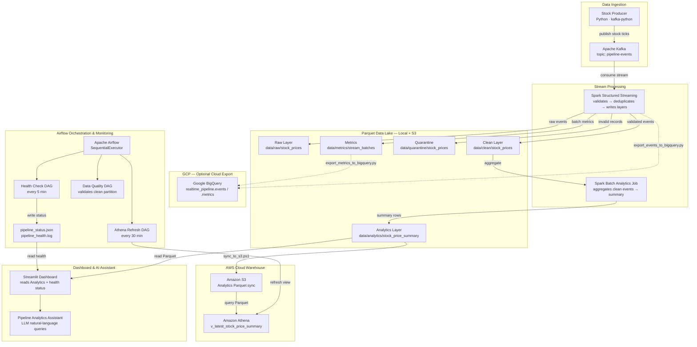

# Architecture & Data Flow

## Overview

This project implements a real-time stock-market data pipeline that ingests live price ticks through Kafka, processes them with Spark Structured Streaming, stores validated data in a layered Parquet data lake, syncs analytics output to AWS S3 for querying via Athena, and presents results through a Streamlit dashboard with an LLM-powered natural-language assistant. Apache Airflow orchestrates monitoring, data-quality checks, and Athena view refreshes. Google BigQuery is available as an optional cloud-warehouse export target.

---

## Architecture Diagram



---

## Data Flow Explanation

### Step 1 — Ingestion

The **Stock Producer** (`producer/stock_producer.py`) is a Python container that generates simulated stock-price tick events for symbols such as AAPL, MSFT, and NVDA. Each event includes symbol, price, source, and event timestamp. Spark enriches processed records with Kafka metadata (topic, partition, offset) when available. The producer publishes these events to the Apache Kafka topic `pipeline-events`.

### Step 2 — Stream Processing

**Spark Structured Streaming** (`spark/jobs/`) consumes the Kafka stream in micro-batches. For each micro-batch, Spark performs:

1. **Schema validation** — events must match the expected schema (symbol, price, source, event_time).
2. **Deduplication** — duplicate events within the same micro-batch are removed.
3. **Routing** — valid events go to the Clean layer; invalid events go to Quarantine.

Spark writes four outputs per micro-batch:

| Output | Path | Description |
|---|---|---|
| Raw | `data/raw/stock_prices/event_date=YYYY-MM-DD/` | All consumed events, unfiltered |
| Clean | `data/clean/stock_prices/event_date=YYYY-MM-DD/` | Validated, deduplicated events |
| Quarantine | `data/quarantine/stock_prices/event_date=YYYY-MM-DD/` | Events that failed validation |
| Metrics | `data/metrics/stream_batches/` | Per-batch counts (raw, clean, quarantine) with timestamps |

### Step 3 — Analytics Aggregation

A **Spark batch analytics job** reads the latest Clean partition and produces the Analytics layer (`data/analytics/stock_price_summary/event_date=YYYY-MM-DD/`). Each summary row represents one symbol and source combination with:

- `tick_count` — number of price ticks
- `min_price`, `max_price`, `avg_price` — price statistics
- `latest_price` — most recent observed price
- `first_event_time`, `last_event_time` — event time range
- `processed_at` — job execution timestamp

### Step 4 — AWS S3 Sync and Athena Query

The `sync_to_s3.ps1` script uploads the Analytics Parquet partition to Amazon S3 under the analytics prefix. **Amazon Athena** queries this data through the view `v_latest_stock_price_summary`, which returns the most recent summary rows across all partitions. The Airflow `refresh_athena_analytics` DAG refreshes this view every 30 minutes to ensure Athena reflects the latest synced data.

### Step 5 — Airflow Orchestration & Monitoring

Apache Airflow runs three DAGs that orchestrate and monitor the pipeline:

| DAG | Schedule | Purpose |
|---|---|---|
| `pipeline_health_check` | Every 5 minutes | Checks Kafka, Spark Master, and PostgreSQL service reachability; writes `pipeline_status.json` (current snapshot) and appends to `pipeline_health.log` (audit trail) |
| `pipeline_data_quality_check` | Scheduled | Validates the latest Clean partition — checks row count, null prices, and schema integrity |
| `refresh_athena_analytics` | Every 30 minutes | Refreshes the Athena `v_latest_stock_price_summary` view to reflect newly synced S3 data |

**Monitoring artifacts** (written to `data/monitoring/`):

| File | Purpose |
|---|---|
| `pipeline_status.json` | Machine-readable current health snapshot, overwritten on each check. Contains overall status, per-service checks (Kafka, Spark, PostgreSQL), and errors list |
| `pipeline_health.log` | Append-only text log of every health-check result, providing an operational audit trail |

**Retry logic:** Each Airflow task is configured with `retries=1` and `retry_delay=timedelta(minutes=1)`. If a task fails (e.g., Kafka is temporarily unreachable), Airflow automatically retries it once after one minute. If the retry also fails, the task is marked failed and the failure is recorded in the monitoring artifacts. This provides a balance between resilience and fast failure detection.

### Step 6 — Dashboard & AI Assistant

The **Streamlit Dashboard** (`dashboard/app.py`) runs in a Docker container and provides:

- Pipeline health status (read from `pipeline_status.json`)
- Analytics metrics (tick count, unique symbols, freshness)
- Latest price by symbol table
- Price range bar chart
- Full analytics summary table

The **Pipeline Analytics Assistant** (`dashboard/pages/`) is a Streamlit multipage app that uses an LLM to answer natural-language questions about pipeline output:

- "Summarize the latest pipeline output"
- "Show latest prices for AAPL, MSFT, and NVDA"
- "What is the daily summary for AAPL?"

The assistant reads the same Analytics Parquet partition as the dashboard. It uses an allowlisted query set and refuses financial advice requests.

### Step 7 — Optional GCP BigQuery Export

Google BigQuery is an optional cloud-warehouse export path. Two scripts in the `gcp/` directory export pipeline data to BigQuery:

| Script | Source | BigQuery Table |
|---|---|---|
| `gcp/export_events_to_bigquery.py` | Raw pipeline events | `realtime_pipeline.events` |
| `gcp/export_metrics_to_bigquery.py` | Streaming batch metrics | `realtime_pipeline.metrics` |

These scripts are retained as an optional secondary cloud-warehouse path for Looker Studio dashboards and BigQuery analysis. They are not required to run the local stock-price streaming pipeline, which uses **AWS S3 + Athena as its primary validated analytics path**. The BigQuery dataset is `realtime_pipeline` under GCP project `steadfast-sign-473019-h5`.

---

## Data Layer Design

```
data/
├── raw/                    # Raw Layer — unfiltered Kafka events
│   └── stock_prices/
│       └── event_date=YYYY-MM-DD/
├── clean/                  # Clean Layer — validated, deduplicated events
│   └── stock_prices/
│       └── event_date=YYYY-MM-DD/
├── quarantine/             # Quarantine — records that failed validation
│   └── stock_prices/
│       └── event_date=YYYY-MM-DD/
├── analytics/              # Analytics Layer — aggregated summaries
│   └── stock_price_summary/
│       └── event_date=YYYY-MM-DD/
├── metrics/                # Operational metrics — per-batch counts
│   └── stream_batches/
└── monitoring/             # Pipeline health artifacts
    ├── pipeline_status.json
    └── pipeline_health.log
```

All layers are partitioned by `event_date` for efficient reads. The Raw layer preserves every consumed event for auditability. The Clean layer is the trusted source for downstream analytics. The Analytics layer provides pre-computed aggregates that power the dashboard and assistant.

---

## Docker Compose Services

| Service | Container | Purpose |
|---|---|---|
| `zookeeper` | confluentinc/cp-zookeeper | Kafka coordination |
| `broker` | confluentinc/cp-kafka | Kafka message broker |
| `postgres` | postgres:14 | Airflow metadata database |
| `airflow` | apache/airflow:2.7.3 | Airflow webserver |
| `airflow-scheduler` | apache/airflow:2.7.3 | Airflow scheduler |
| `airflow-init` | apache/airflow:2.7.3 | Airflow DB migration (one-time) |
| `spark-master` | apache/spark:3.5.0 | Spark cluster master |
| `spark-worker` | apache/spark:3.5.0 | Spark cluster worker |
| `producer` | python:3.11-slim | Stock price event producer |
| `dashboard` | python:3.11-slim | Streamlit dashboard + LLM assistant |

All services communicate over the `pipeline-network` Docker bridge network. Data is shared through bind mounts of the `./data` directory at `/opt/spark-data` inside Spark containers and `/app/data` inside the dashboard container.

---

## Technology Stack

| Layer | Technology |
|---|---|
| Message Broker | Apache Kafka (Confluent 7.4.0) |
| Stream Processing | Apache Spark 3.5.0 Structured Streaming |
| Data Format | Parquet (partitioned by event_date) |
| Orchestration | Apache Airflow 2.7.3 |
| Cloud Storage | Amazon S3 |
| Cloud Query Engine | Amazon Athena |
| Optional Cloud Warehouse | Google BigQuery |
| Dashboard | Streamlit |
| AI/LLM | OpenAI API (natural-language query routing) |
| Containerization | Docker Compose |
| Language | Python, Scala/PySpark, SQL |

---

## Validation Evidence

- Streamlit dashboard renders latest Analytics Parquet output (metrics, price tables, charts).
- Pipeline Analytics Assistant answers allowlisted natural-language queries and refuses financial advice.
- Airflow `pipeline_health_check` writes `pipeline_status.json` and `pipeline_health.log` every 5 minutes.
- Airflow `pipeline_data_quality_check` validates the latest Clean partition.
- Athena view `v_latest_stock_price_summary` returns latest summary rows from synced S3 Parquet.
- Optional BigQuery export scripts (`export_events_to_bigquery.py`, `export_metrics_to_bigquery.py`) are retained under `gcp/`.
