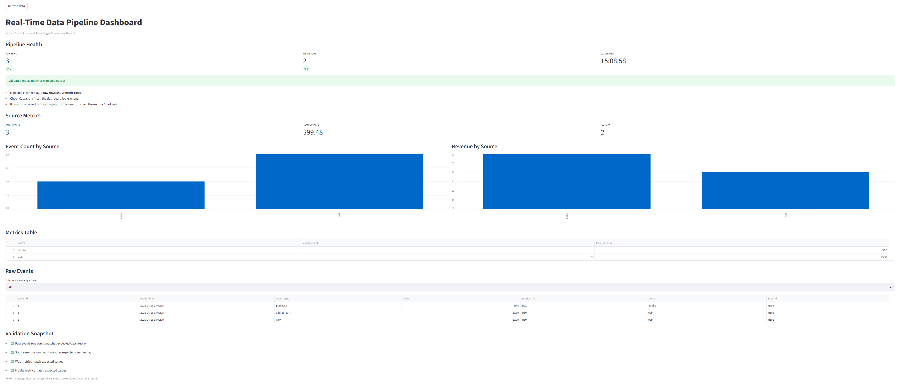
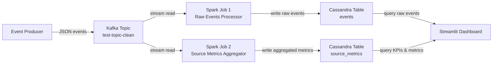
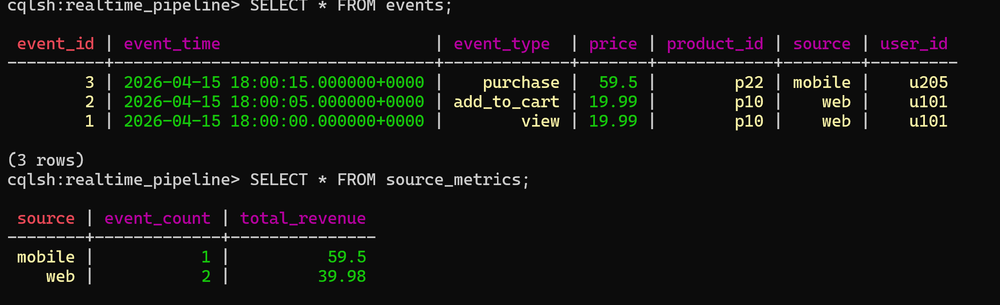
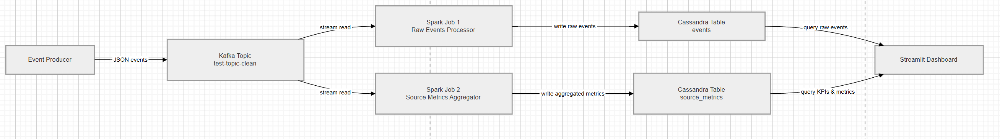

# Real-Time Data Pipeline by Hoang

<p align="center">
  
</p>

A real-time data engineering project that ingests JSON event data through Kafka, processes it with Spark Structured Streaming, stores raw and aggregated outputs in Cassandra, and visualizes the results in a Streamlit dashboard.

This project was built as a portfolio-style demo to show end-to-end streaming, validation, debugging, and operational thinking.

---

## Highlights

- Kafka-based ingestion of streaming JSON events
- Spark jobs for raw event persistence and source-level aggregation
- Cassandra storage for `events` and `source_metrics`
- Streamlit dashboard for KPIs, charts, and validation checks
- Pytest coverage for configuration, validation, and dashboard loading logic
- Docker Compose setup for a reproducible local environment

---

## Architecture



---

## Project Goal

The goal of this project is to demonstrate a practical real-time streaming pipeline using tools commonly used in modern data engineering workflows. It also shows reproducibility, validation, and debugging skills.

The system answers a simple near-real-time analytics question: what events are arriving, which traffic sources produced them, and how much revenue is associated with each source?

---

## Tech Stack

| Layer | Tool | Purpose |
|---|---|---|
| Messaging | Apache Kafka | Receives streaming JSON event messages |
| Stream processing | Spark Structured Streaming | Reads Kafka data, validates it, and computes aggregates |
| Database | Apache Cassandra | Stores raw events and source-level metrics |
| Dashboard | Streamlit | Displays KPIs, charts, and raw event tables |
| Containerization | Docker Compose | Runs the local multi-service environment |
| Language | Python | Implements Spark jobs, validation, and dashboard logic |

---

## Project Structure

```text
Real-Time-Data-Engineering-Pipeline/
├── config.py
├── dashboard.py
├── docker-compose.yml
├── images/
│   ├── cassandra-validation.png
│   ├── dashboard-screenshot.png
│   └── diagram.png
├── spark_kafka.py
├── spark_kafka_json.py
├── spark_kafka_source_metrics.py
├── spark_kafka_to_cassandra.py
├── tests/
│   ├── conftest.py
│   ├── test_config.py
│   ├── test_dashboard.py
│   └── test_validation.py
├── utils/
│   ├── __init__.py
│   ├── logging_config.py
│   ├── schema.py
│   └── validation.py
├── RUNBOOK.md
├── MONITORING.md
└── README.md
```

---

## Data Flow

1. A producer sends JSON event records into the Kafka topic.
2. `spark_kafka_to_cassandra.py` reads the stream and writes parsed events into Cassandra `events`.
3. `spark_kafka_source_metrics.py` reads the same stream, groups by `source`, and writes event counts plus revenue totals into Cassandra `source_metrics`.
4. The Streamlit dashboard reads Cassandra and displays KPIs, charts, and raw event records.

---

## Demo Output

A clean validation run produced:

- 3 rows in `events`
- 2 rows in `source_metrics`
- `web` with 2 events and 39.98 total revenue
- `mobile` with 1 event and 59.50 total revenue

---

## Screenshots

### Cassandra Validation


### Pipeline Diagram


---

## How to Run Locally

### 1. Start the services

```bash
docker-compose up -d
```

### 2. Run the Spark jobs

Raw events job:

```bash
docker exec -it spark-master bash
/opt/spark/bin/spark-submit \
  --master spark://spark-master:7077 \
  --conf spark.jars.ivy=/tmp/.ivy2 \
  --conf spark.cassandra.connection.host=cassandra \
  --packages org.apache.spark:spark-sql-kafka-0-10_2.12:3.5.0,com.datastax.spark:spark-cassandra-connector_2.12:3.5.0 \
  /opt/spark_kafka_to_cassandra.py
```

Metrics job:

```bash
docker exec -it spark-master bash
/opt/spark/bin/spark-submit \
  --master spark://spark-master:7077 \
  --conf spark.jars.ivy=/tmp/.ivy2 \
  --conf spark.cassandra.connection.host=cassandra \
  --packages org.apache.spark:spark-sql-kafka-0-10_2.12:3.5.0,com.datastax.spark:spark-cassandra-connector_2.12:3.5.0 \
  /opt/spark_kafka_source_metrics.py
```

### 3. Send test events to Kafka

```bash
docker exec -it broker bash
kafka-console-producer --topic test-topic-clean --bootstrap-server localhost:9092
```

Example events:

```json
{"event_id":"1","user_id":"u101","event_type":"view","product_id":"p10","price":"19.99","event_time":"2026-04-15T18:00:00","source":"web"}
{"event_id":"2","user_id":"u101","event_type":"add_to_cart","product_id":"p10","price":"19.99","event_time":"2026-04-15T18:00:05","source":"web"}
{"event_id":"3","user_id":"u205","event_type":"purchase","product_id":"p22","price":"59.50","event_time":"2026-04-15T18:00:15","source":"mobile"}
```

### 4. Verify Cassandra output

```bash
docker exec -it cassandra cqlsh
```

```sql
USE realtime_pipeline;
SELECT * FROM events;
SELECT * FROM source_metrics;
```

### 5. Run the dashboard

```bash
python -m streamlit run dashboard.py
```

---

## Testing

Run the full test suite:

```bash
python -m pytest tests/ -v -s
```

Current test coverage includes:

- `config.py`
- `utils/validation.py`
- `dashboard.py`

At the current milestone, the suite passes successfully with 11 tests.

---

## Clean Reset Workflow

A clean replay requires more than truncating Cassandra because Kafka topic history and Spark checkpoints can preserve prior state.

1. Stop both Spark jobs.
2. Stop the dashboard if needed.
3. Remove Spark checkpoint directories.
4. Truncate Cassandra tables.
5. Use a clean Kafka topic such as `test-topic-clean`.
6. Restart the Spark jobs.
7. Replay test events.
8. Re-run Cassandra validation queries.

Example reset commands:

```bash
rm -rf /tmp/checkpoints/raw_events
rm -rf /tmp/checkpoints/raw_events_invalid
rm -rf /tmp/checkpoints/source_metrics
rm -rf /tmp/checkpoints/source_metrics_invalid
```

```sql
USE realtime_pipeline;
TRUNCATE events;
TRUNCATE source_metrics;
```

---

## Problems Solved

This project addressed several practical issues common in streaming setups:

- Python 3.12 caused Cassandra driver issues for the dashboard, so the dashboard environment was kept on Python 3.11.
- Cassandra table resets alone were not enough because Kafka history and Spark checkpoints could still replay old data.
- The raw-events job and the metrics job had to be validated independently.

---

## Operations Docs

- `RUNBOOK.md` — startup, reset, validation, and troubleshooting
- `MONITORING.md` — health checks, expected outputs, and troubleshooting order

---

## Credits

This project was inspired by the original idea from:

- [JesusdelCas99/Real-Time-Data-Engineering-Pipeline](https://github.com/JesusdelCas99/Real-Time-Data-Engineering-Pipeline)

This version adds a customized dataset, a Streamlit dashboard, validation improvements, operational documentation, and reproducible local reset workflows.