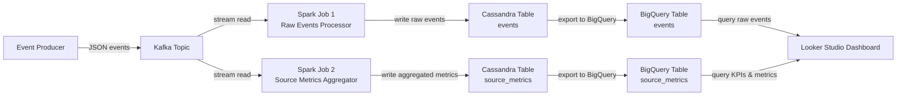
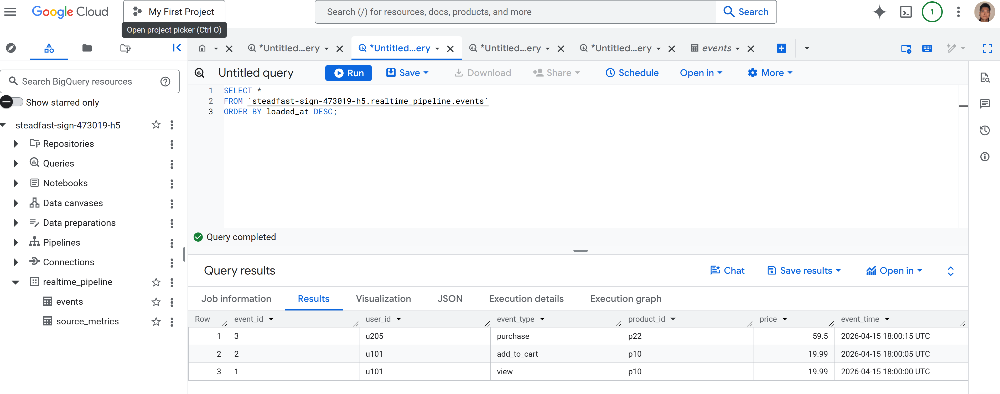
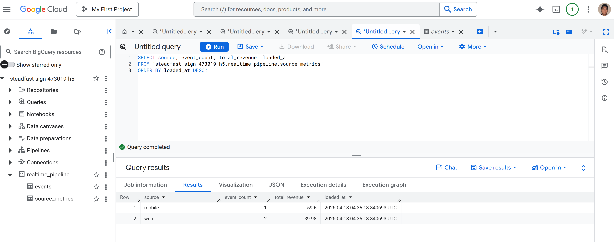
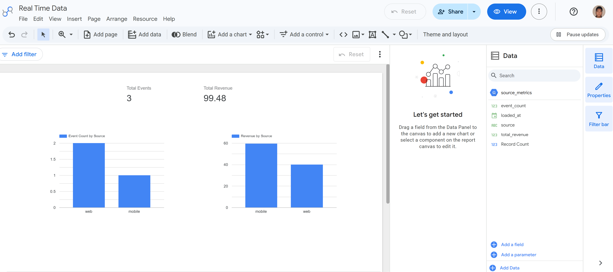

# Real-Time Data Pipeline by Hoang

A real-time data engineering project that ingests JSON event data through Kafka, processes it with Spark Structured Streaming, stores processed data locally and in the cloud, and visualizes the results in Looker Studio.

This project was built as a portfolio-style demo to show end-to-end streaming, validation, debugging, cloud integration, and analytics delivery.

---

## Highlights

- Kafka-based ingestion of streaming JSON events.
- Spark jobs for parsing, validation, and aggregation.
- Cassandra storage for raw events and source-level metrics.
- BigQuery export layer for cloud analytics.
- Looker Studio dashboard for KPI and chart visualization.
- Pytest coverage for configuration, validation, and dashboard logic.
- Docker Compose setup for a reproducible local environment.

---

## Architecture



---

## Project Goal

The goal of this project is to demonstrate a practical real-time streaming pipeline using tools commonly used in modern data engineering workflows.

The system answers a simple analytics question: what events are arriving, which traffic sources produced them, and how much revenue is associated with each source?

---

## Tech Stack

| Layer | Tool | Purpose |
|---|---|---|
| Messaging | Apache Kafka | Receives streaming JSON event messages |
| Stream processing | Spark Structured Streaming | Reads Kafka data, validates it, and computes aggregates |
| Operational store | Apache Cassandra | Stores raw events and source-level metrics |
| Cloud warehouse | Google Cloud Platform / BigQuery | Stores exported event and metric data |
| Dashboard | Looker Studio | Displays KPIs and charts |
| Containerization | Docker Compose | Runs the local multi-service environment |
| Language | Python | Implements Spark jobs, validation, and export logic |

---

## Project Structure

```text
Real-Time-Data-Engineering-Pipeline/
├── config.py
├── dashboard.py
├── docker-compose.yml
├── gcp/
│   ├── export_events_to_bigquery.py
│   └── export_metrics_to_bigquery.py
├── images/
│   ├── cassandra-validation.png
│   ├── dashboard-screenshot.png
│   ├── diagram.png
│   ├── bigquery-events.png
│   ├── bigquery-metrics.png
│   └── looker-studio-dashboard.png
├── spark_kafka.py
├── spark_kafka_json.py
├── spark_kafka_source_metrics.py
├── spark_kafka_to_cassandra.py
├── tests/
│   ├── conftest.py
│   ├── test_config.py
│   ├── test_dashboard.py
│   └── test_validation.py
├── utils/
│   ├── __init__.py
│   ├── logging_config.py
│   ├── schema.py
│   └── validation.py
├── RUNBOOK.md
├── MONITORING.md
└── README.md
```

---

## Data Flow

1. A producer sends JSON event records into the Kafka topic.
2. Spark reads the stream and parses the incoming events.
3. Validation logic filters or prepares the records for downstream use.
4. Aggregation jobs compute source-level metrics such as event count and revenue total.
5. Processed results are written to Cassandra.
6. The GCP export scripts move Cassandra data into BigQuery.
7. Looker Studio reads the BigQuery tables and displays the final dashboard.

---

## GCP Setup

To run the BigQuery export scripts locally, first authenticate with Application Default Credentials:

```bash
gcloud auth application-default login
```

Then activate the Python 3.11 virtual environment and install the required package:

```bash
.venv311\Scripts\activate
pip install google-cloud-bigquery
```

After that, run the export scripts:

```bash
python gcp\export_metrics_to_bigquery.py
python gcp\export_events_to_bigquery.py
```

These scripts read data from Cassandra and insert it into the `realtime_pipeline` dataset in BigQuery.

---

## GCP Layer

The `gcp/` folder contains the cloud export scripts used to move data from Cassandra into BigQuery.

It includes:
- `export_events_to_bigquery.py` for exporting raw event records
- `export_metrics_to_bigquery.py` for exporting aggregated source metrics

These scripts load the data into the `realtime_pipeline` dataset in BigQuery and add a `loaded_at` timestamp so the cloud layer is traceable.

This is the step that connects the local streaming pipeline to the analytics dashboard.

---

## Demo Output

A clean validation run produced:
- 3 rows in the raw events output
- 2 rows in the metrics output
- `web` and `mobile` source summaries
- total revenue values aggregated correctly by source

Example metric output:
- `mobile`: 1 event, 59.50 total revenue
- `web`: 2 events, 39.98 total revenue

---

## Screenshots

### Pipeline Diagram


### Validation Output


### BigQuery Events


### BigQuery Metrics


### Looker Studio Dashboard


---

## How to Run Locally

### 1. Start the services

```bash
docker-compose up -d
```

### 2. Run the Spark jobs

Start the raw events job and the metrics job from your Spark environment using the commands from your project setup.

### 3. Send test events to Kafka

Use your Kafka producer to publish test JSON records into the topic.

Example events:

```json
{"event_id":"1","user_id":"u101","event_type":"view","product_id":"p10","price":"19.99","event_time":"2026-04-15T18:00:00","source":"web"}
{"event_id":"2","user_id":"u101","event_type":"add_to_cart","product_id":"p10","price":"19.99","event_time":"2026-04-15T18:00:05","source":"web"}
{"event_id":"3","user_id":"u205","event_type":"purchase","product_id":"p22","price":"59.50","event_time":"2026-04-15T18:00:15","source":"mobile"}
```

### 4. Verify Cassandra output

Check the output tables in Cassandra to confirm rows were written successfully.

### 5. Export to BigQuery

Run the scripts in the `gcp/` folder to move the data into BigQuery.

### 6. Open Looker Studio

Connect the BigQuery tables to your report and verify the dashboard renders correctly.

---

## Testing

Run the full test suite:

```bash
python -m pytest tests/ -v -s
```

Current test coverage includes:
- `config.py`
- `utils/validation.py`
- `dashboard.py`

At the current milestone, the suite passes successfully.

---

## Clean Reset Workflow

A clean replay requires resetting both streaming state and downstream outputs.

1. Stop the Spark jobs.
2. Clear any checkpoint directories.
3. Reset the Cassandra tables.
4. Re-run the export scripts if needed.
5. Refresh the BigQuery tables.
6. Refresh the Looker Studio dashboard.
7. Replay the test events.
8. Re-check the results in the dashboard.

---

## Problems Solved

This project addressed several practical issues common in streaming setups:

- Python 3.12 caused Cassandra driver compatibility issues, so the project used Python 3.11 for the export and dashboard workflows.
- Streaming state and checkpointing had to be handled carefully to avoid stale outputs.
- Raw event handling and aggregate metrics had to be validated independently.
- The local pipeline and cloud analytics layer had to stay in sync for the final dashboard.

---

## Operations Docs

- `RUNBOOK.md` — startup, reset, validation, and troubleshooting
- `MONITORING.md` — health checks, expected outputs, and troubleshooting order

---

## Credits

This project was inspired by the original idea from:

- [JesusdelCas99/Real-Time-Data-Engineering-Pipeline](https://github.com/JesusdelCas99/Real-Time-Data-Engineering-Pipeline)

This version adds a customized dataset, GCP export scripts, a Looker Studio dashboard, validation improvements, and reproducible local workflow documentation.