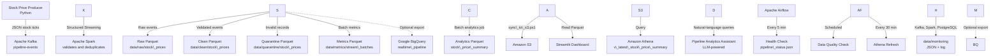

\# AI-Assisted Real-Time Stock Analytics Platform


A production-minded real-time data platform that ingests stock-price events with Apache Kafka, processes and validates streaming data with Spark Structured Streaming, and publishes analytics-ready datasets to Amazon S3 and Athena.


The platform gives analysts a Streamlit dashboard and a guarded natural-language analytics assistant for exploring curated market-data summaries without writing SQL. It includes layered Parquet storage, data-quality quarantine handling, Airflow orchestration, health monitoring, and reproducible Docker-based local deployment.


!\[Streamlit dashboard showing real-time stock-price analytics and pipeline health](images/dashboard-overview.png)


\## Key Features


\- \*\*Real-time streaming:\*\* Kafka ingests stock-price ticks and Spark Structured Streaming processes micro-batches every 10 seconds.

\- \*\*Data-quality controls:\*\* Required-field validation, Kafka-offset deduplication, and a quarantine layer retain invalid events with explicit rejection reasons.

\- \*\*Cloud analytics:\*\* Curated analytics Parquet is synchronized to Amazon S3 and queried through Amazon Athena.

\- \*\*Operational workflows:\*\* Airflow schedules data-quality checks, service-health checks, retries, and Athena-refresh work.

\- \*\*Analytics experience:\*\* A Streamlit dashboard exposes current pipeline health, latest prices, summary metrics, and visual analytics.

\- \*\*Natural-language exploration:\*\* A guarded LLM assistant answers allowlisted questions against curated analytics output without arbitrary SQL execution or financial advice.


\## Demo


\### Ask a natural-language question


> \*\*User:\*\* Show latest prices for AAPL, MSFT, and NVDA.

>

> \*\*Assistant:\*\* Returns the latest available prices, event timestamps, and processed tick counts from the curated Analytics Parquet output.


!\[Pipeline Analytics Assistant returning latest prices for AAPL, MSFT, and NVDA](images/pipeline-analytics-assistant.png)


\### Explore pipeline health and analytics


The dashboard above presents service-health status, analytics freshness, symbol-level latest prices, price-range summaries, and processed-tick coverage.


\*\*Business value:\*\* The platform reduces time-to-insight by giving analysts a governed way to inspect fresh market-data summaries through a dashboard or natural-language questions, without manually querying raw streaming data or writing SQL.


For the full system design, see \[ARCHITECTURE.md](ARCHITECTURE.md).


\## Architecture



```mermaid

flowchart TB

   P\[Stock Price Producer<br/>Python] -->|JSON stock ticks| K\[Apache Kafka<br/>pipeline-events]


   K -->|Structured Streaming| S\[Apache Spark<br/>validates and deduplicates]


   S -->|Raw events| R\[Raw Parquet<br/>data/raw/stock\_prices]

   S -->|Validated events| C\[Clean Parquet<br/>data/clean/stock\_prices]

   S -->|Invalid records| Q\[Quarantine Parquet<br/>data/quarantine/stock\_prices]

   S -->|Batch metrics| M\[Metrics Parquet<br/>data/metrics/stream\_batches]


   C -->|Batch analytics job| A\[Analytics Parquet<br/>stock\_price\_summary]

   A -->|sync\_to\_s3.ps1| S3\[Amazon S3]

   S3 -->|Query| ATH\[Amazon Athena<br/>v\_latest\_stock\_price\_summary]


   A -->|Read Parquet| D\[Streamlit Dashboard]

   D -->|Natural-language queries| LLM\[Pipeline Analytics Assistant<br/>LLM-powered]


   AF\[Apache Airflow] -->|Every 5 min| H\[Health Check<br/>pipeline\_status.json]

   AF -->|Scheduled| DQ\[Data Quality Check]

   AF -->|Every 30 min| AR\[Athena Refresh]


   H -->|Kafka, Spark, PostgreSQL| MON\[data/monitoring<br/>JSON + log]


   S -.->|Optional export| BQ\[Google BigQuery<br/>realtime\_pipeline]

   M -.->|Optional export| BQ

```


\## Pipeline Flow


1\. A Python producer publishes JSON stock-price events to the Kafka topic `pipeline-events`.

2\. Spark Structured Streaming consumes Kafka micro-batches every 10 seconds.

3\. Each batch is retained in the raw Parquet layer for traceability.

4\. Spark validates required fields: a non-empty `symbol`, a positive numeric `price`, and `event\_time`.

5\. Valid events are deduplicated using Kafka topic, partition, and offset, then written to partitioned clean Parquet data.

6\. Invalid events are retained in the quarantine layer with a validation-error reason.

7\. Spark writes batch-level raw, clean, and quarantine counts to the metrics layer.

8\. A Spark analytics job creates daily stock-price summaries by event date, symbol, and source.

9\. Analytics Parquet is synchronized to Amazon S3 and queried through Athena.

10\. Airflow schedules data-quality checks, health checks, and Athena-refresh work.

11\. The Streamlit dashboard reads the latest analytics partition and pipeline-health status.

12\. The Pipeline Analytics Assistant answers allowlisted natural-language questions about pipeline output and stock-price summaries.


\## Tech Stack


| Layer | Technology | Purpose |

|---|---|---|

| Event producer | Python | Publishes stock-price tick events |

| Event transport | Apache Kafka | Durable streaming through `pipeline-events` |

| Stream processing | Apache Spark 3.5 | Validation, deduplication, Parquet persistence, and batch metrics |

| Storage format | Apache Parquet | Raw, clean, quarantine, metrics, and analytics data layers |

| Orchestration | Apache Airflow 2.7 | Data-quality, health-check, and Athena-refresh workflows |

| Metadata database | PostgreSQL 14 | Airflow metadata storage |

| Cloud storage | Amazon S3 | Stores synchronized analytics Parquet data |

| Query engine | Amazon Athena | Queries S3-backed stock-price analytics |

| Dashboard | Streamlit | Displays pipeline health and market-data analytics |

| AI assistant | OpenAI API | Routes allowlisted natural-language analytics questions |

| Containerization | Docker Compose | Reproducible multi-service local environment |

| Optional warehouse export | Google BigQuery | Optional secondary export path for events and metrics |


\## Data Layers


| Layer | Location | Purpose |

|---|---|---|

| Raw | `data/raw/stock\_prices` | Immutable record of ingested Kafka payloads and ingestion metadata |

| Clean | `data/clean/stock\_prices` | Validated and deduplicated stock-price events, partitioned by `event\_date` |

| Quarantine | `data/quarantine/stock\_prices` | Rejected events with validation-error context |

| Metrics | `data/metrics/stream\_batches` | Per-micro-batch raw, clean, and quarantine counts |

| Analytics | `data/analytics/stock\_price\_summary` | Daily stock-price summary by date, symbol, and source |

| Monitoring | `data/monitoring` | Current pipeline-health JSON and append-only health history |


\## Analytics Model


The Spark analytics job produces daily stock-price summaries grouped by:


```text

event\_date, symbol, source

```


Each summary contains:


```text

tick\_count

min\_price

max\_price

avg\_price

latest\_price

first\_event\_time

last\_event\_time

processed\_at

```


The analytics dataset is partitioned by `event\_date`, supporting incremental and partition-aware cloud queries.


\## Run Locally


\### Prerequisites


\- Docker Desktop with Docker Compose

\- Python, if you want to run local helper scripts

\- AWS credentials configured only when using S3/Athena features

\- An OpenAI API key in `.env` for the Pipeline Analytics Assistant

\- A local `.env` file containing your configuration; do not commit this file


\### 1. Start the stack


From the repository root:


```powershell

docker compose up -d

```


Check service status:


```powershell

docker compose ps

```


Expected core services include:


```text

airflow

airflow-scheduler

broker

postgres

spark-master

spark-worker

stock-producer

pipeline-dashboard

```


\### 2. Start the streaming job


Use the project helper script:


```powershell

.\\start\_stream.ps1

```


The streaming job reads Kafka events and writes raw, clean, quarantine, metrics, and checkpoint data under `data/`.


\### 3. Build the analytics layer


After clean events exist, submit the analytics job:


```powershell

docker exec -it spark-master /opt/spark/bin/spark-submit `

 --master spark://spark-master:7077 `

 /opt/spark-apps/build\_analytics\_layer.py

```


\### 4. Open local interfaces


| Service | Local URL |

|---|---|

| Airflow | `http://localhost:8080` |

| Spark Master UI | `http://localhost:8081` |

| Streamlit dashboard | `http://localhost:8501` |


\### 5. Verify monitoring


Trigger `pipeline\_health\_check` in Airflow, or wait for its five-minute schedule. Then inspect:


```powershell

Get-Content .\\data\\monitoring\\pipeline\_status.json

Get-Content .\\data\\monitoring\\pipeline\_health.log -Tail 5

```


A healthy result includes:


```json

{

 "status": "healthy",

 "errors\_seen": \[]

}

```


\## Pipeline Evidence


\### Active Spark Structured Streaming Job


The Spark Master UI shows the active `kafka-to-parquet-stream` application consuming events from Kafka with a live worker and allocated executor resources.


!\[Spark Master UI showing the active kafka-to-parquet-stream Structured Streaming application](images/spark-streaming-job.png)


\### Data-Quality Quarantine Handling


Spark validates every incoming stock-price event before it reaches the clean layer. Records that fail validation are retained in the quarantine Parquet layer with their validation reason and quarantine timestamp instead of being silently dropped.


The example below shows an intentionally invalid `AAPL` event with `price = -25.5` routed to quarantine with `validation\_error = non\_positive\_price`.


!\[Spark Shell query showing an invalid negative-price AAPL event retained in the quarantine Parquet layer](images/quarantine-negative-price.png)


\### Airflow Orchestration


Airflow schedules data-quality and pipeline-health checks every five minutes and refreshes Athena analytics every 30 minutes.


| DAG | Schedule | Responsibility |

|---|---|---|

| `pipeline\_data\_quality\_check` | Every 5 minutes | Validates pipeline data-quality expectations |

| `pipeline\_health\_check` | Every 5 minutes | Verifies Kafka, Spark Master, and PostgreSQL connectivity |

| `refresh\_athena\_analytics` | Every 30 minutes | Refreshes the Athena analytics view |


!\[Airflow DAGs showing successful data quality, health check, and Athena refresh workflows](images/airflow-dags-success.png)


Each Airflow task retries once after one minute. The health-check DAG writes operational artifacts to:


```text

data/monitoring/

├── pipeline\_status.json

└── pipeline\_health.log

```


`pipeline\_status.json` contains the latest machine-readable health snapshot, while `pipeline\_health.log` maintains append-only execution history.


For operational details, see \[MONITORING.md](MONITORING.md) and \[RUNBOOK.md](RUNBOOK.md).


\### Amazon Athena Analytics


Analytics Parquet data is synchronized to Amazon S3 and queried through the `v\_latest\_stock\_price\_summary` Athena view.


!\[Amazon Athena query results showing latest stock-price summary metrics from S3-backed Parquet data](images/athena-query-results.png)


The primary cloud analytics workflow is:


```text

Clean Parquet → Analytics Parquet → Amazon S3 → Amazon Athena

```


Use the included helper to synchronize local analytics data:


```powershell

.\\sync\_to\_s3.ps1

```


AWS credentials and bucket details remain in local configuration and are never committed.


\## Pipeline Analytics Assistant


The dashboard includes a guarded natural-language assistant for pipeline health and stock-price analytics. It reads the same analytics Parquet output used by the dashboard.


The assistant uses allowlisted query patterns. It is intentionally read-only: it cannot modify data, control services, run arbitrary SQL, or provide financial advice.


Supported questions include:


```text

Summarize the latest pipeline output

What is the latest price for AAPL?

Show latest prices for AAPL, MSFT, and NVDA

Give me AAPL summary for 2026-09-15

```


!\[Pipeline Analytics Assistant returning latest prices for AAPL, MSFT, and NVDA](images/pipeline-analytics-assistant.png)


\## Validation and Testing


Run Python tests from the repository root:


```powershell

python -m pytest tests -v

```


Run the Spark smoke test:


```powershell

docker exec -it spark-master /opt/spark/bin/spark-submit `

 --master spark://spark-master:7077 `

 /opt/spark-apps/smoke\_test.py

```


Operational validation checklist:


\- Docker services are running: `docker compose ps`

\- Spark Structured Streaming is active and writing data

\- Raw, clean, quarantine, metrics, and analytics layers exist under `data/`

\- Invalid records include an explicit rejection reason in quarantine Parquet

\- Airflow health-check and data-quality DAGs complete successfully

\- `data/monitoring/pipeline\_status.json` reports `healthy`

\- Athena queries the S3-backed analytics table or view

\- The Streamlit dashboard renders the latest analytics output

\- The Pipeline Analytics Assistant answers allowlisted questions only


\## Optional Google BigQuery Export


> \*\*Optional extension:\*\* BigQuery export and Looker Studio demonstrate a secondary warehouse/reporting path. The validated primary analytics workflow is Analytics Parquet → Amazon S3 → Amazon Athena → Streamlit.


The `gcp/` directory contains optional utilities that export pipeline events and streaming metrics to a Google BigQuery dataset named `realtime\_pipeline`.


| Script | Source | BigQuery table |

|---|---|---|

| `gcp/export\_events\_to\_bigquery.py` | Pipeline events | `realtime\_pipeline.events` |

| `gcp/export\_metrics\_to\_bigquery.py` | Streaming metrics | `realtime\_pipeline.metrics` |


\### BigQuery Event Export


The optional event export loads pipeline event records into `realtime\_pipeline.events` for cloud-warehouse analysis.


!\[BigQuery query results showing optional exported pipeline event records](images/bigquery-events.png)


\### BigQuery Metrics Export


The optional metrics export loads source-level event counts and revenue metrics into `realtime\_pipeline.source\_metrics`.


!\[BigQuery query results showing optional exported pipeline source metrics](images/bigquery-metrics.png)


\### Optional Looker Studio Exploration


A Looker Studio dashboard can visualize the optional BigQuery export path.


!\[Looker Studio dashboard using the optional BigQuery export dataset](images/looker-studio-dashboard.png)


See \[gcp/README.md](gcp/README.md) for requirements and usage.


\## Engineering Decisions


\- \*\*Layered Parquet storage:\*\* Raw, clean, quarantine, metrics, and analytics layers preserve traceability while separating valid events from rejected data.

\- \*\*Kafka-offset deduplication:\*\* Kafka topic, partition, and offset provide a stable event identity within the stream.

\- \*\*Partitioned analytics:\*\* Clean and analytics data are partitioned by event date for efficient incremental processing and cloud queries.

\- \*\*Quarantine instead of silent drops:\*\* Invalid events are preserved with explicit error reasons.

\- \*\*Independent orchestration:\*\* Airflow manages data quality, infrastructure health, and Athena refresh as separate workflows.

\- \*\*Retry logic:\*\* Airflow tasks retry once after one minute to handle transient service failures.

\- \*\*Machine-readable monitoring:\*\* The health DAG produces a current JSON status file and append-only health log.

\- \*\*Guarded AI assistant:\*\* The assistant uses allowlisted queries and cannot modify data, execute arbitrary SQL, or operate infrastructure.

\- \*\*Local-first reproducibility:\*\* Docker Compose runs the full local stack, while S3/Athena provides the primary cloud analytics path.

\- \*\*Optional BigQuery support:\*\* BigQuery export utilities are isolated as a secondary integration rather than presented as a required part of the primary architecture.


\## Additional Screenshots


The repository retains additional implementation and validation screenshots in the \[`images/`](images/) directory, including Airflow cluster activity and Cassandra validation artifacts from supporting or exploratory work.


\## Project Structure


```text

Real-Time-Data-Engineering-Pipeline/

├── airflow/

│   └── dags/

│       ├── pipeline\_data\_quality\_check.py

│       ├── pipeline\_health\_check.py

│       └── refresh\_athena\_analytics.py

├── dashboard/

│   ├── app.py

│   └── pages/

│       └── 1\_Pipeline\_Analytics\_Assistant.py

├── data/

│   └── monitoring/

│       └── .gitkeep

├── gcp/

│   ├── README.md

│   ├── export\_events\_to\_bigquery.py

│   └── export\_metrics\_to\_bigquery.py

├── images/

├── llm/

│   ├── \_\_init\_\_.py

│   ├── analytics\_backend.py

│   ├── assistant.py

│   └── demo.py

├── producer/

│   ├── requirements.txt

│   └── stock\_producer.py

├── spark/

│   └── jobs/

│       ├── build\_analytics\_layer.py

│       ├── kafka\_stream.py

│       └── smoke\_test.py

├── tests/

├── utils/

├── ARCHITECTURE.md

├── docker-compose.yml

├── MONITORING.md

├── README.md

├── RUNBOOK.md

├── run\_health\_check.ps1

├── start\_stream.ps1

└── sync\_to\_s3.ps1

```


\## License


This project is licensed under the MIT License. See \[LICENSE](LICENSE).

