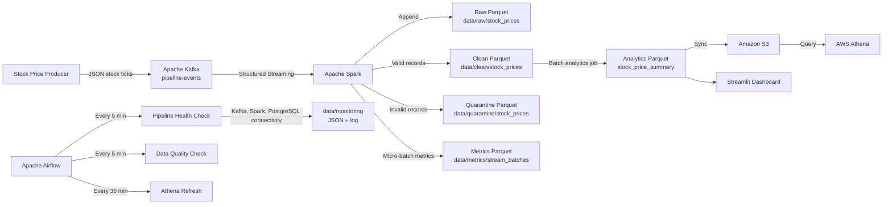
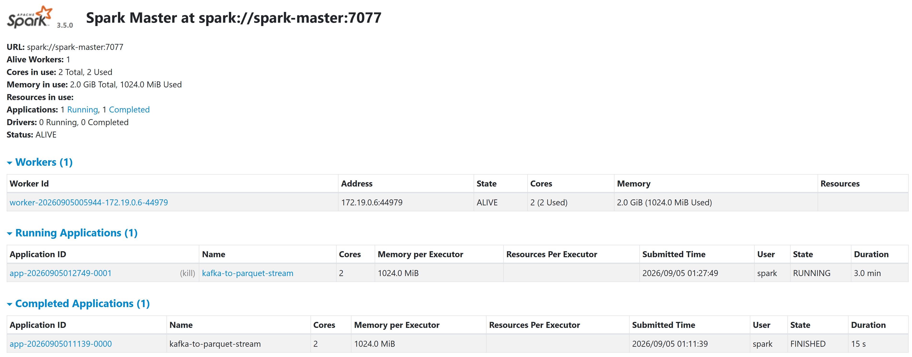

# Real-Time Stock Price Data Engineering Pipeline

A containerized, end-to-end streaming data pipeline that ingests stock-price events from Kafka, processes and validates them with Apache Spark Structured Streaming, persists layered Parquet datasets, publishes analytics-ready data to Amazon S3 and Athena, and exposes operational health through Apache Airflow.

The project is designed as a local, reproducible data-engineering portfolio implementation. It emphasizes streaming ingestion, data quality, layered storage, cloud analytics, orchestration, and monitoring.

<p align="center">
  
</p>

## Architecture


```mermaid
flowchart LR
    P[Stock Price Producer] -->|JSON stock ticks| K[Apache Kafka<br/>pipeline-events]

    K -->|Structured Streaming| S[Apache Spark]

    S -->|Append| R[Raw Parquet<br/>data/raw/stock_prices]
    S -->|Valid records| C[Clean Parquet<br/>data/clean/stock_prices]
    S -->|Invalid records| Q[Quarantine Parquet<br/>data/quarantine/stock_prices]
    S -->|Micro-batch metrics| M[Metrics Parquet<br/>data/metrics/stream_batches]

    C -->|Batch analytics job| A[Analytics Parquet<br/>stock_price_summary]
    A -->|Sync| S3[Amazon S3]
    S3 -->|Query| ATH[AWS Athena]

    A --> D[Streamlit Dashboard]

    AF[Apache Airflow] -->|Every 5 min| H[Pipeline Health Check]
    AF -->|Every 5 min| DQ[Data Quality Check]
    AF -->|Every 30 min| AR[Athena Refresh]

    H -->|Kafka, Spark, PostgreSQL connectivity| MON[data/monitoring<br/>JSON + log]
```

## Pipeline Flow

1. The Python producer publishes JSON stock-price events to the Kafka topic `pipeline-events`.
2. Spark Structured Streaming reads Kafka micro-batches every 10 seconds.
3. Each batch is retained in the raw layer for traceability.
4. Spark validates that each event has a non-empty `symbol`, a positive numeric `price`, and an `event_time`.
5. Valid events are deduplicated by Kafka topic, partition, and offset, then written to partitioned clean Parquet data.
6. Invalid events are written to the quarantine layer with a validation-error reason.
7. Spark writes batch-level counts for raw, clean, and quarantined records.
8. The analytics job creates daily stock-price summaries by event date, symbol, and source.
9. Analytics Parquet is synchronized to S3 and queried in Athena.
10. Airflow schedules quality checks, Athena refresh work, and infrastructure health checks.

## Data Layers

| Layer | Location | Purpose |
|---|---|---|
| Raw | `data/raw/stock_prices` | Immutable record of ingested Kafka payloads and ingestion metadata |
| Clean | `data/clean/stock_prices` | Validated and deduplicated stock-price events, partitioned by `event_date` |
| Quarantine | `data/quarantine/stock_prices` | Rejected events with validation-error context |
| Metrics | `data/metrics/stream_batches` | Per-micro-batch raw, clean, and quarantine counts |
| Analytics | `data/analytics/stock_price_summary` | Daily summary by date, symbol, and source |
| Monitoring | `data/monitoring` | Current pipeline health JSON and append-only health history |

## Analytics Model

The Spark analytics job produces daily stock-price summaries grouped by:

```text
event_date, symbol, source
```

Each summary includes:

- `tick_count`
- `min_price`
- `max_price`
- `avg_price`
- `latest_price`
- `first_event_time`
- `last_event_time`
- `processed_at`

The analytics dataset is partitioned by `event_date`, making it suitable for partition-aware cloud queries.

## Tech Stack

| Layer | Technology | Purpose |
|---|---|---|
| Event producer | Python | Publishes stock-price tick events |
| Streaming ingestion | Apache Kafka | Durable event transport through `pipeline-events` |
| Stream processing | Apache Spark 3.5 | Validation, deduplication, Parquet persistence, metrics |
| Storage format | Apache Parquet | Columnar storage for raw, clean, quarantine, metrics, and analytics layers |
| Orchestration | Apache Airflow 2.7 | Data-quality, health-check, and Athena-refresh workflows |
| Cloud storage | Amazon S3 | Stores synchronized analytics Parquet data |
| Query engine | Amazon Athena | Queries S3-based analytics datasets |
| Dashboard | Streamlit | Displays the analytics layer locally |
| Metadata database | PostgreSQL 14 | Stores Airflow metadata |
| Containerization | Docker Compose | Reproducible local multi-service environment |
| Optional warehouse export | Google BigQuery | Legacy/optional Cassandra-to-BigQuery export utilities |

## Airflow Operations

| DAG | Schedule | Responsibility |
|---|---|---|
| `pipeline_data_quality_check` | Every 5 minutes | Validates pipeline data-quality expectations |
| `pipeline_health_check` | Every 5 minutes | Verifies Kafka, Spark master, and PostgreSQL TCP connectivity |
| `refresh_athena_analytics` | Every 30 minutes | Refreshes the Athena analytics workflow |

The health-check DAG writes operational artifacts to:

```text
data/monitoring/
├── pipeline_status.json
└── pipeline_health.log
```

`pipeline_status.json` contains the latest structured health snapshot. `pipeline_health.log` is an append-only execution history. These runtime files are intentionally excluded from version control.

For full operational details, see [MONITORING.md](MONITORING.md) and [RUNBOOK.md](RUNBOOK.md).

## Project Structure

```text
Real-Time-Data-Engineering-Pipeline/
├── airflow/
│   └── dags/
│       ├── pipeline_data_quality_check.py
│       ├── pipeline_health_check.py
│       └── refresh_athena_analytics.py
├── dashboard/
│   └── app.py
├── data/
│   └── monitoring/
│       └── .gitkeep
├── gcp/
│   ├── README.md
│   ├── export_events_to_bigquery.py
│   └── export_metrics_to_bigquery.py
├── images/
├── producer/
│   ├── requirements.txt
│   └── stock_producer.py
├── spark/
│   └── jobs/
│       ├── build_analytics_layer.py
│       ├── kafka_stream.py
│       └── smoke_test.py
├── tests/
├── utils/
├── docker-compose.yml
├── MONITORING.md
├── RUNBOOK.md
├── start_stream.ps1
└── sync_to_s3.ps1
```

## Run Locally

### Prerequisites

- Docker Desktop with Docker Compose
- Python, if you want to run local helper scripts
- AWS credentials configured only when using S3/Athena features
- A `.env` file with your local configuration; do not commit this file

### 1. Start the stack

From the repository root:

```powershell
docker compose up -d
```

Check service status:

```powershell
docker compose ps
```

Expected core services include:

- `airflow`
- `airflow-scheduler`
- `broker`
- `postgres`
- `spark-master`
- `spark-worker`
- `stock-producer`
- `pipeline-dashboard`

### 2. Start the streaming job

Use the project helper script:

```powershell
.\start_stream.ps1
```

The streaming job reads from Kafka and writes to the raw, clean, quarantine, metrics, and checkpoint locations under `data/`.

### 3. Build the analytics layer

After clean events exist, submit the analytics job to Spark:

```powershell
docker exec -it spark-master /opt/spark/bin/spark-submit `
  --master spark://spark-master:7077 `
  /opt/spark-apps/build_analytics_layer.py
```

### 4. Open local interfaces

| Service | Local URL |
|---|---|
| Airflow | `http://localhost:8080` |
| Spark master UI | `http://localhost:8081` |
| Streamlit dashboard | `http://localhost:8501` |

### 5. Verify monitoring

Trigger `pipeline_health_check` in Airflow or wait for its five-minute schedule. Then inspect:

```powershell
Get-Content .\data\monitoring\pipeline_status.json
Get-Content .\data\monitoring\pipeline_health.log -Tail 5
```

A healthy result contains:

```json
{
  "status": "healthy",
  "errors_seen": []
}
```

## AWS Analytics

The analytics dataset is synchronized from local Parquet storage to Amazon S3. Athena queries the S3-backed analytics data, including the latest stock-price summary view.

The intended analytics workflow is:

```text
Clean Parquet → Analytics Parquet → Amazon S3 → AWS Athena
```

The `sync_to_s3.ps1` helper is used to synchronize local data to S3. AWS credentials and bucket details remain in local configuration and are never committed.

## Optional Google BigQuery Utilities

The `gcp/` directory contains optional Cassandra-to-BigQuery export utilities retained from an earlier extension of the project.

These scripts are not required for the current Kafka → Spark → Parquet → S3/Athena stock-price pipeline. They require a reachable Cassandra source, BigQuery tables, and Google Application Default Credentials.

See [gcp/README.md](gcp/README.md) for requirements and usage.

## Validation and Testing

Run Python tests from the project root:

```powershell
python -m pytest tests -v
```

Run the Spark smoke test:

```powershell
docker exec -it spark-master /opt/spark/bin/spark-submit `
  --master spark://spark-master:7077 `
  /opt/spark-apps/smoke_test.py
```

Operational validation checklist:

- Docker services are running: `docker compose ps`
- Spark stream is active and writing data
- Clean, quarantine, metrics, and analytics layers exist under `data/`
- Athena can query the S3-backed analytics table/view
- Airflow health check succeeds
- `data/monitoring/pipeline_status.json` reports `healthy`

## Screenshots

### Airflow DAGs


### Spark



## Engineering Decisions

- **Layered Parquet storage:** Raw, clean, quarantine, metrics, and analytics layers preserve traceability while separating valid records from bad data.
- **Kafka-offset deduplication:** Valid events are deduplicated using Kafka topic, partition, and offset, creating a stable event identity within the stream.
- **Partitioned analytics:** Clean data and analytics are partitioned by event date to support efficient incremental cloud queries.
- **Quarantine instead of silent drops:** Invalid records are retained with error reasons instead of being discarded.
- **Independent orchestration:** Airflow controls data quality, infrastructure health, and analytics refresh as separate scheduled workflows.
- **Machine-readable monitoring:** The health DAG writes a current JSON status file and a persistent log in addition to Airflow task logs.
- **Local-first reproducibility:** Docker Compose runs the local stack, while S3/Athena integration provides the cloud analytics path.
- **Honest optional GCP support:** Legacy Cassandra-to-BigQuery utilities are isolated and documented separately rather than presented as part of the active stock-price flow.

## License

This project is licensed under the MIT License. See [LICENSE](LICENSE).