# Real-Time Stock Price Data Engineering Pipeline

A containerized, end-to-end streaming data pipeline that ingests stock-price events from Apache Kafka, validates and processes them with Apache Spark Structured Streaming, persists traceable Parquet data layers, publishes analytics-ready data to Amazon S3 and Athena, monitors pipeline health through Apache Airflow, and exposes results through a Streamlit dashboard with a read-only LLM-powered analytics assistant.

The project is designed as a reproducible, local-first data-engineering portfolio implementation. It demonstrates real-time ingestion, data quality, layered storage, cloud analytics, orchestration, monitoring, and controlled AI-assisted data exploration.

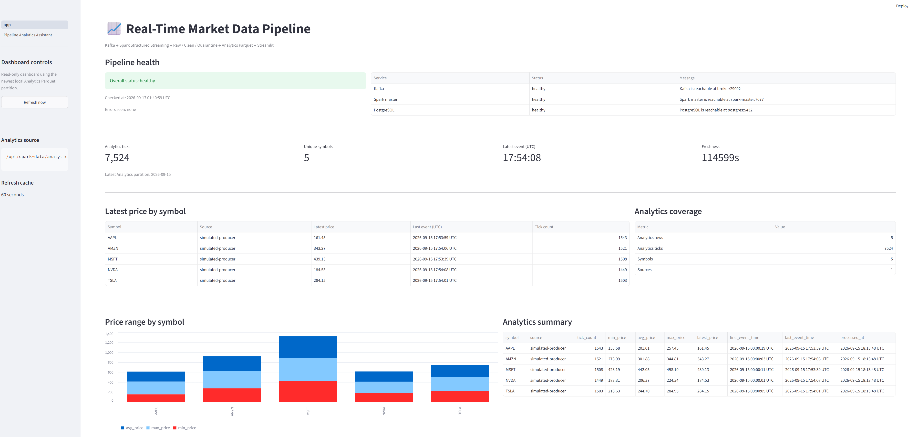

For the full system design, see [ARCHITECTURE.md](ARCHITECTURE.md).

## Architecture

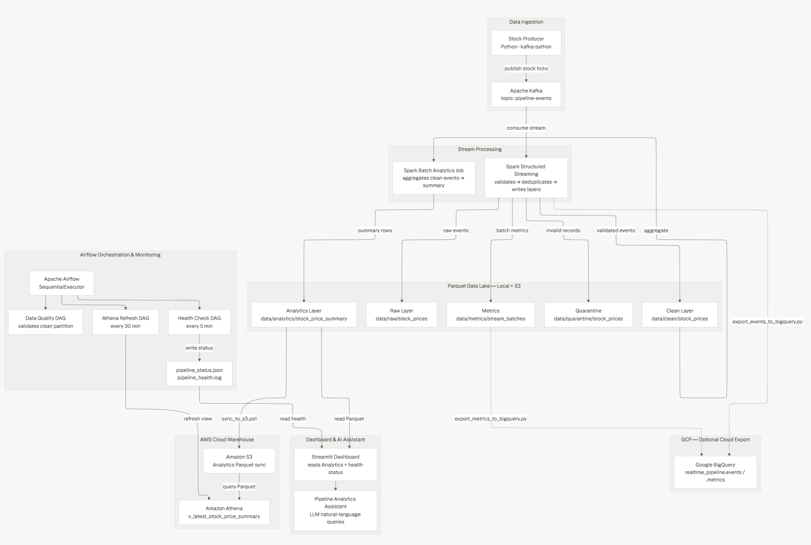

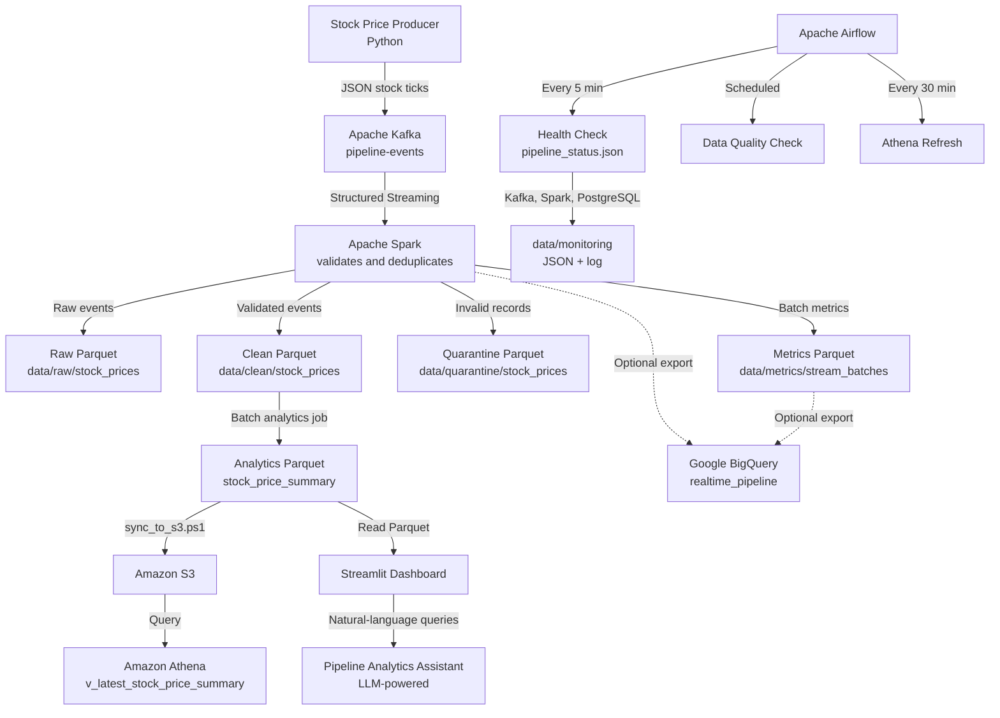
```mermaid

flowchart TB

   P[Stock Price Producer<br/>Python] -->|JSON stock ticks| K[Apache Kafka<br/>pipeline-events]

   K -->|Structured Streaming| S[Apache Spark<br/>validates and deduplicates]

   S -->|Raw events| R[Raw Parquet<br/>data/raw/stock_prices]

   S -->|Validated events| C[Clean Parquet<br/>data/clean/stock_prices]

   S -->|Invalid records| Q[Quarantine Parquet<br/>data/quarantine/stock_prices]

   S -->|Batch metrics| M[Metrics Parquet<br/>data/metrics/stream_batches]

   C -->|Batch analytics job| A[Analytics Parquet<br/>stock_price_summary]

   A -->|sync_to_s3.ps1| S3[Amazon S3]

   S3 -->|Query| ATH[Amazon Athena<br/>v_latest_stock_price_summary]

   A -->|Read Parquet| D[Streamlit Dashboard]

   D -->|Natural-language queries| LLM[Pipeline Analytics Assistant<br/>LLM-powered]

   AF[Apache Airflow] -->|Every 5 min| H[Health Check<br/>pipeline_status.json]

   AF -->|Scheduled| DQ[Data Quality Check]

   AF -->|Every 30 min| AR[Athena Refresh]

   H -->|Kafka, Spark, PostgreSQL| MON[data/monitoring<br/>JSON + log]

   S -.->|Optional export| BQ[Google BigQuery<br/>realtime_pipeline]

   M -.->|Optional export| BQ

```

## Pipeline Flow

1\. A Python producer publishes JSON stock-price events to the Kafka topic `pipeline-events`.

2\. Spark Structured Streaming consumes Kafka micro-batches every 10 seconds.

3\. Each batch is retained in the raw Parquet layer for traceability.

4\. Spark validates required fields: a non-empty `symbol`, a positive numeric `price`, and `event_time`.

5\. Valid events are deduplicated using Kafka topic, partition, and offset, then written to partitioned clean Parquet data.

6\. Invalid events are retained in the quarantine layer with a validation-error reason.

7\. Spark writes batch-level raw, clean, and quarantine counts to the metrics layer.

8\. A Spark analytics job creates daily stock-price summaries by event date, symbol, and source.

9\. Analytics Parquet is synchronized to Amazon S3 and queried through Athena.

10\. Airflow schedules data-quality checks, health checks, and Athena-refresh work.

11\. The Streamlit dashboard reads the latest analytics partition and pipeline-health status.

12\. The Pipeline Analytics Assistant answers allowlisted natural-language questions about pipeline output and stock-price summaries.

## Tech Stack

| Layer | Technology | Purpose |

|---|---|---|

| Event producer | Python | Publishes stock-price tick events |

| Event transport | Apache Kafka | Durable streaming through `pipeline-events` |

| Stream processing | Apache Spark 3.5 | Validation, deduplication, Parquet persistence, and batch metrics |

| Storage format | Apache Parquet | Raw, clean, quarantine, metrics, and analytics data layers |

| Orchestration | Apache Airflow 2.7 | Data-quality, health-check, and Athena-refresh workflows |

| Metadata database | PostgreSQL 14 | Airflow metadata storage |

| Cloud storage | Amazon S3 | Stores synchronized analytics Parquet data |

| Query engine | Amazon Athena | Queries S3-backed stock-price analytics |

| Dashboard | Streamlit | Displays pipeline health and market-data analytics |

| AI assistant | OpenAI API | Routes allowlisted natural-language analytics questions |

| Containerization | Docker Compose | Reproducible multi-service local environment |

| Optional warehouse export | Google BigQuery | Optional secondary export path for events and metrics |

## Data Layers

| Layer | Location | Purpose |

|---|---|---|

| Raw | `data/raw/stock_prices` | Immutable record of ingested Kafka payloads and ingestion metadata |

| Clean | `data/clean/stock_prices` | Validated and deduplicated stock-price events, partitioned by `event_date` |

| Quarantine | `data/quarantine/stock_prices` | Rejected events with validation-error context |

| Metrics | `data/metrics/stream_batches` | Per-micro-batch raw, clean, and quarantine counts |

| Analytics | `data/analytics/stock_price_summary` | Daily summary by event date, symbol, and source |

| Monitoring | `data/monitoring` | Current pipeline-health JSON and append-only health history |

## Analytics Model

The Spark analytics job produces daily stock-price summaries grouped by:

```text

event_date, symbol, source

```

Each summary contains:

```text

tick_count

min_price

max_price

avg_price

latest_price

first_event_time

last_event_time

processed_at

```

The analytics dataset is partitioned by `event_date`, supporting incremental and partition-aware cloud queries.

## Run Locally

### Prerequisites

- Docker Desktop with Docker Compose

- Python, if you want to run local helper scripts

- AWS credentials configured only when using S3/Athena features

- An OpenAI API key in `.env` for the Pipeline Analytics Assistant

- A local `.env` file containing your configuration; do not commit this file

### 1. Start the stack

From the repository root:

```powershell

docker compose up -d

```

Check service status:

```powershell

docker compose ps

```

Expected core services include:

```text

airflow

airflow-scheduler

broker

postgres

spark-master

spark-worker

stock-producer

pipeline-dashboard

```

### 2. Start the streaming job

Use the project helper script:

```powershell

.\\start_stream.ps1

```

The streaming job reads Kafka events and writes raw, clean, quarantine, metrics, and checkpoint data under `data/`.

### 3. Build the analytics layer

After clean events exist, submit the analytics job:

```powershell

docker exec -it spark-master /opt/spark/bin/spark-submit `

 --master spark://spark-master:7077 `

 /opt/spark-apps/build_analytics_layer.py

```

### 4. Open local interfaces

| Service | Local URL |

|---|---|

| Airflow | `http://localhost:8080` |

| Spark Master UI | `http://localhost:8081` |

| Streamlit dashboard | `http://localhost:8501` |

### 5. Verify monitoring

Trigger `pipeline_health_check` in Airflow, or wait for its five-minute schedule. Then inspect:

```powershell

Get-Content .\\data\\monitoring\\pipeline_status.json

Get-Content .\\data\\monitoring\\pipeline_health.log -Tail 5

```

A healthy result includes:

```json

{

 "status": "healthy",

 "errors_seen": []

}

```

## Pipeline Evidence

### Active Spark Structured Streaming Job

The Spark Master UI shows the active `kafka-to-parquet-stream` application consuming events from Kafka with a live worker and allocated executor resources.

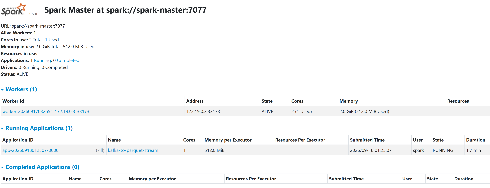

### Data-Quality Quarantine Handling

Spark validates every incoming stock-price event before it reaches the clean layer. Records that fail validation are retained in the quarantine Parquet layer with their validation reason and quarantine timestamp instead of being silently dropped.

The example below shows an intentionally invalid `AAPL` event with `price = -25.5` routed to quarantine with `validation_error = non_positive_price`.

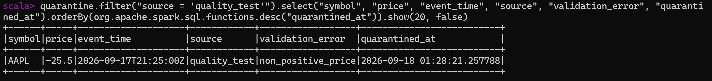

### Airflow Orchestration

Airflow schedules data-quality and pipeline-health checks every five minutes and refreshes Athena analytics every 30 minutes.

| DAG | Schedule | Responsibility |

|---|---|---|

| `pipeline_data_quality_check` | Every 5 minutes | Validates pipeline data-quality expectations |

| `pipeline_health_check` | Every 5 minutes | Verifies Kafka, Spark Master, and PostgreSQL connectivity |

| `refresh_athena_analytics` | Every 30 minutes | Refreshes the Athena analytics view |

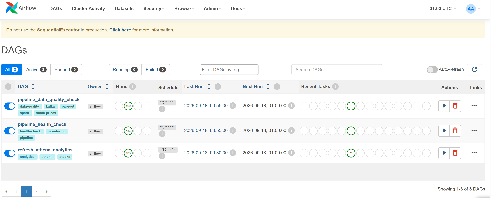

Each Airflow task retries once after one minute. The health-check DAG writes operational artifacts to:

```text

data/monitoring/

├── pipeline_status.json

└── pipeline_health.log

```

`pipeline_status.json` contains the latest machine-readable health snapshot, while `pipeline_health.log` maintains append-only execution history.

For operational details, see [MONITORING.md](MONITORING.md) and [RUNBOOK.md](RUNBOOK.md).

### Amazon Athena Analytics

Analytics Parquet data is synchronized to Amazon S3 and queried through the `v_latest_stock_price_summary` Athena view.

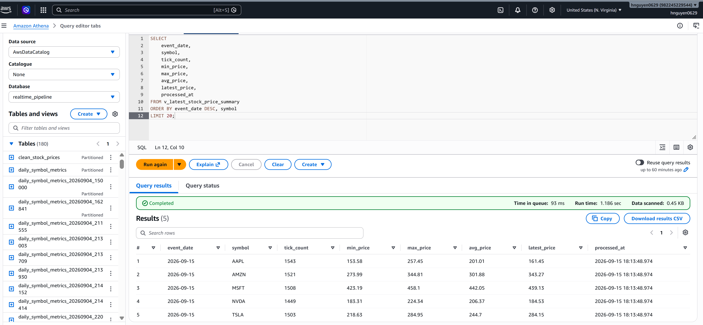

The primary cloud analytics workflow is:

```text

Clean Parquet → Analytics Parquet → Amazon S3 → Amazon Athena

```

Use the included helper to synchronize local analytics data:

```powershell

.\\sync_to_s3.ps1

```

AWS credentials and bucket details remain in local configuration and are never committed.

## Pipeline Analytics Assistant

The dashboard includes a read-only natural-language assistant for pipeline health and stock-price analytics. It reads the same analytics Parquet output used by the dashboard.

The assistant uses allowlisted query patterns. It cannot modify data, control services, run arbitrary SQL, or provide financial advice.

Supported questions include:

```text

Summarize the latest pipeline output

What is the latest price for AAPL?

Show latest prices for AAPL, MSFT, and NVDA

Give me AAPL summary for 2026-09-15

```

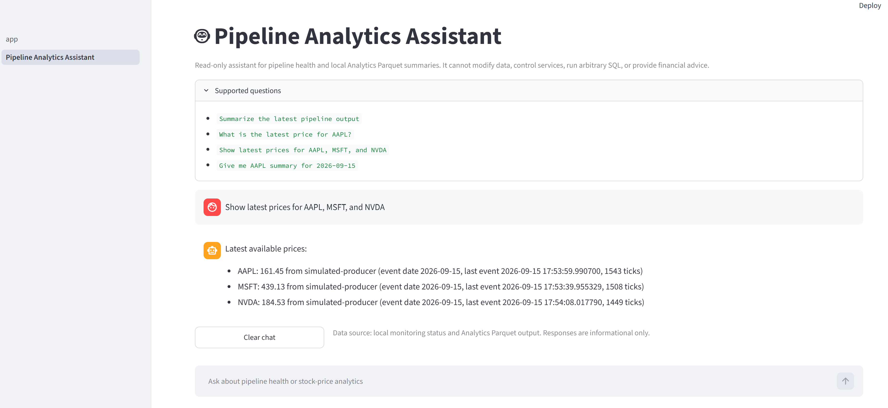

## Validation and Testing

Run Python tests from the repository root:

```powershell

python -m pytest tests -v

```

Run the Spark smoke test:

```powershell

docker exec -it spark-master /opt/spark/bin/spark-submit `

 --master spark://spark-master:7077 `

 /opt/spark-apps/smoke_test.py

```

Operational validation checklist:

- Docker services are running: `docker compose ps`

- Spark Structured Streaming is active and writing data

- Raw, clean, quarantine, metrics, and analytics layers exist under `data/`

- Invalid records include an explicit rejection reason in quarantine Parquet

- Airflow health-check and data-quality DAGs complete successfully

- `data/monitoring/pipeline_status.json` reports `healthy`

- Athena queries the S3-backed analytics table or view

- The Streamlit dashboard renders the latest analytics output

- The Pipeline Analytics Assistant answers allowlisted questions only

## Optional Google BigQuery Export

The `gcp/` directory contains optional utilities that export pipeline events and streaming metrics to a Google BigQuery dataset named `realtime_pipeline`.

| Script | Source | BigQuery table |

|---|---|---|

| `gcp/export_events_to_bigquery.py` | Pipeline events | `realtime_pipeline.events` |

| `gcp/export_metrics_to_bigquery.py` | Streaming metrics | `realtime_pipeline.metrics` |

This is an optional secondary warehouse path. It is not required to run the primary local stock-price streaming pipeline, which uses Amazon S3 and Athena as its validated analytics path.

### BigQuery Event Export

The optional event export loads pipeline event records into `realtime_pipeline.events` for cloud-warehouse analysis.

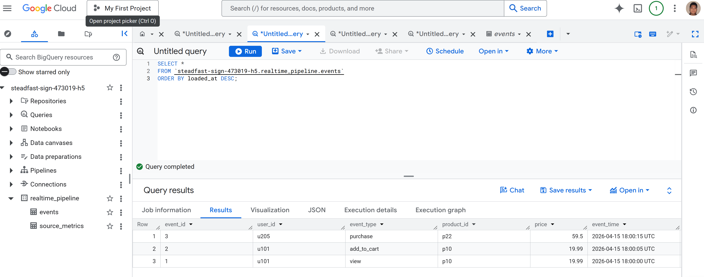

### BigQuery Metrics Export

The optional metrics export loads source-level event counts and revenue metrics into `realtime_pipeline.source_metrics`.

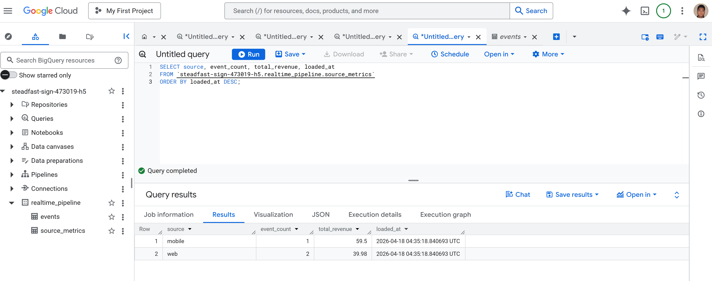

### Optional Looker Studio Exploration

A Looker Studio dashboard can visualize the optional BigQuery export path.

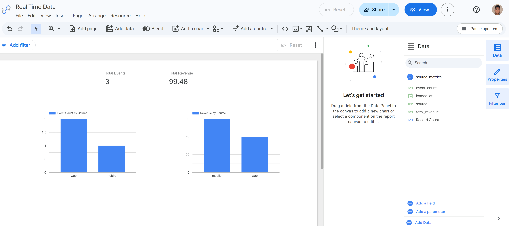

See [gcp/README.md](gcp/README.md) for requirements and usage.

## Engineering Decisions

- **Layered Parquet storage:** Raw, clean, quarantine, metrics, and analytics layers preserve traceability while separating valid events from rejected data.

- **Kafka-offset deduplication:** Kafka topic, partition, and offset provide a stable event identity within the stream.

- **Partitioned analytics:** Clean and analytics data are partitioned by event date for efficient incremental processing and cloud queries.

- **Quarantine instead of silent drops:** Invalid events are preserved with explicit error reasons.

- **Independent orchestration:** Airflow manages data quality, infrastructure health, and Athena refresh as separate workflows.

- **Retry logic:** Airflow tasks retry once after one minute to handle transient service failures.

- **Machine-readable monitoring:** The health DAG produces a current JSON status file and append-only health log.

- **Read-only AI assistant:** The analytics assistant uses allowlisted queries and cannot modify data, execute arbitrary SQL, or operate infrastructure.

- **Local-first reproducibility:** Docker Compose runs the full local stack, while S3/Athena provides the primary cloud analytics path.

- **Optional BigQuery support:** BigQuery export utilities are isolated as a secondary integration rather than presented as a required part of the primary architecture.

## Additional Screenshots

The repository retains additional implementation and validation screenshots in the [`images/`](images/) directory, including Airflow cluster activity and Cassandra validation artifacts from supporting or exploratory work.

## Project Structure

```text

Real-Time-Data-Engineering-Pipeline/

├── airflow/

│   └── dags/

│       ├── pipeline_data_quality_check.py

│       ├── pipeline_health_check.py

│       └── refresh_athena_analytics.py

├── dashboard/

│   ├── app.py

│   └── pages/

│       └── 1_Pipeline_Analytics_Assistant.py

├── data/

│   └── monitoring/

│       └── .gitkeep

├── gcp/

│   ├── README.md

│   ├── export_events_to_bigquery.py

│   └── export_metrics_to_bigquery.py

├── images/

├── llm/

│   ├── __init__.py

│   ├── analytics_backend.py

│   ├── assistant.py

│   └── demo.py

├── producer/

│   ├── requirements.txt

│   └── stock_producer.py

├── spark/

│   └── jobs/

│       ├── build_analytics_layer.py

│       ├── kafka_stream.py

│       └── smoke_test.py

├── tests/

├── utils/

├── ARCHITECTURE.md

├── docker-compose.yml

├── MONITORING.md

├── README.md

├── RUNBOOK.md

├── run_health_check.ps1

├── start_stream.ps1

└── sync_to_s3.ps1

```

## License

This project is licensed under the MIT License. See [LICENSE](LICENSE).

