# AI-Assisted Real-Time Stock Analytics Platform

A production-oriented real-time data platform that ingests stock price events using Apache Kafka, processes and validates streaming data with Spark Structured Streaming, and delivers analytics-ready datasets to Amazon S3 and Athena.

The platform provides a Streamlit dashboard and an LLM-powered natural language analytics assistant, enabling analysts to explore curated market data without writing SQL. It includes layered Parquet storage, data-quality validation with quarantine handling, Airflow orchestration, health monitoring, and reproducible Docker-based deployment.

This project models a financial data monitoring system where analysts require timely, reliable insights, pipeline observability, and controlled access to curated analytics.

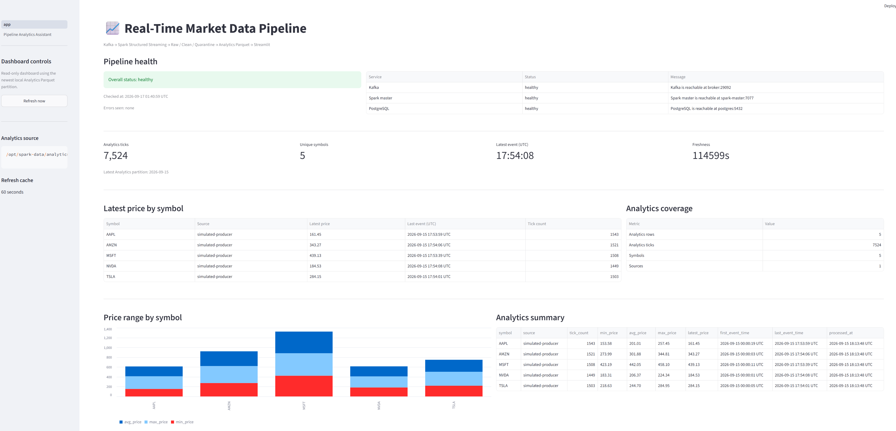

The cloud analytics layer is extended with dbt on Amazon Athena: three SQL models and 14 automated data-quality tests produce a latest-available stock metrics mart. Airflow orchestrates the dbt build, and a dedicated Streamlit page queries the mart. The original dashboard and guarded LLM assistant continue to read local Analytics Parquet.

## Key Features

- **Real-time streaming:** Kafka ingests stock-price ticks and Spark Structured Streaming processes micro-batches every 10 seconds.
- **Data-quality controls:** Required-field validation, Kafka-offset deduplication, and a quarantine layer retain invalid events with explicit rejection reasons.
- **Cloud analytics:** Amazon Athena queries S3-backed Parquet data; dbt models validated stock events into staging, daily metrics, and a latest-available mart.
- **Operational workflows:** Airflow schedules data-quality and service-health checks, creates Athena snapshots, and executes dbt models and tests.
- **Analytics experience:** A Streamlit dashboard exposes current pipeline health, latest prices, summary metrics, and visual analytics.
- **Natural-language analytics:** An LLM-powered assistant translates supported business questions into safe, read-only analytics lookups over curated pipeline output.

## Demo

### Ask a natural-language question

> **User:** Show latest prices for AAPL, MSFT, and NVDA.
>
> **Assistant:** Returns the latest available prices, event timestamps, and processed tick counts from the curated Analytics Parquet output.

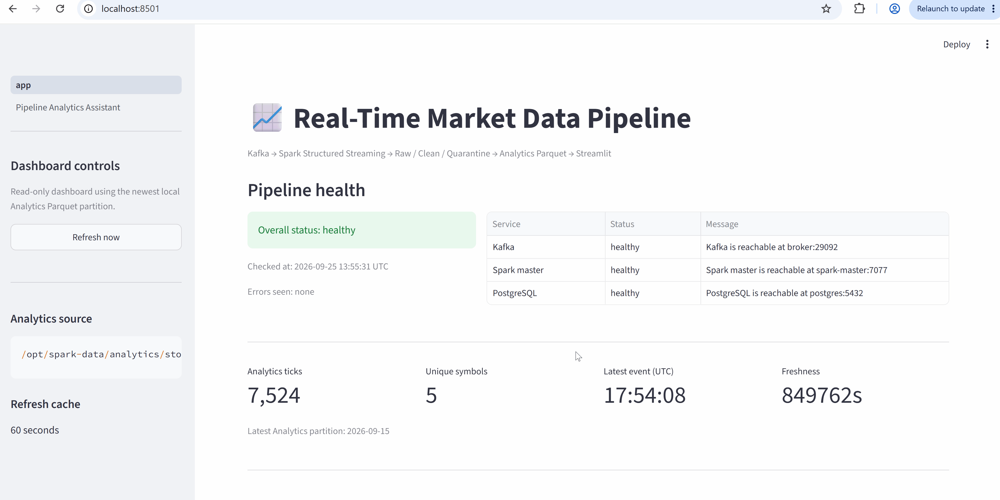

### Explore pipeline health and analytics

The dashboard above presents service-health status, analytics freshness, symbol-level latest prices, price-range summaries, and processed-tick coverage.

**Business value:** The platform reduces time-to-insight by giving analysts a governed way to inspect fresh market-data summaries through a dashboard or natural-language questions, without manually querying raw streaming data or writing SQL.

For the full system design, see [ARCHITECTURE.md](ARCHITECTURE.md).

## Architecture

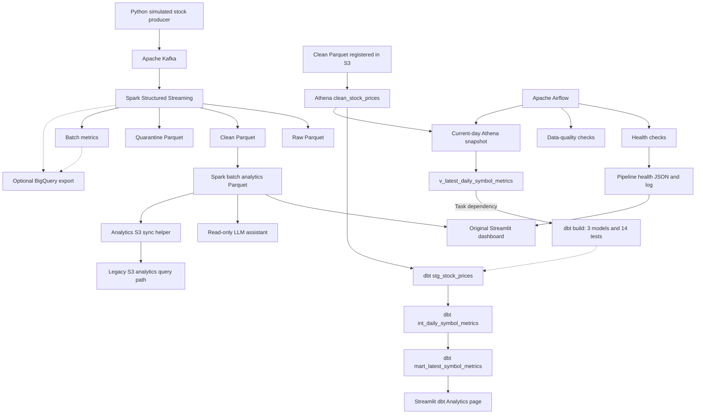
```mermaid
flowchart TB
    P[Python simulated stock producer] --> K[Apache Kafka]
    K --> S[Spark Structured Streaming]
    S --> R[Raw Parquet]
    S --> C[Clean Parquet]
    S --> Q[Quarantine Parquet]
    S --> M[Batch metrics]

    C --> A[Spark batch analytics Parquet]
    A --> D[Original Streamlit dashboard]
    A --> L[Read-only LLM assistant]
    A --> SYNC[Analytics S3 sync helper]
    SYNC --> LEGACY[Legacy S3 analytics query path]

    CS3[Clean Parquet registered in S3] --> CT[Athena clean_stock_prices]
    CT --> ST[dbt stg_stock_prices]
    ST --> INT[dbt int_daily_symbol_metrics]
    INT --> MART[dbt mart_latest_symbol_metrics]
    MART --> PAGE[Streamlit dbt Analytics page]

    AF[Apache Airflow] --> HC[Health checks]
    AF --> DQ[Data-quality checks]
    AF --> SNAP[Current-day Athena snapshot]
    CT --> SNAP
    SNAP --> VIEW[v_latest_daily_symbol_metrics]
    VIEW -->|Task dependency| BUILD[dbt build: 3 models and 14 tests]
    BUILD -.-> ST
    HC --> STATUS[Pipeline health JSON and log]
    STATUS --> D

    S -.-> BQ[Optional BigQuery export]
    M -.-> BQ
```

## Pipeline Flow

1. A Python producer publishes JSON stock-price events to the Kafka topic `pipeline-events`.
2. Spark Structured Streaming consumes Kafka micro-batches every 10 seconds.
3. Each batch is retained in the raw Parquet layer for traceability.
4. Spark validates required fields: a non-empty `symbol`, a positive numeric `price`, and `event_time`.
5. Valid events are deduplicated using Kafka topic, partition, and offset, then written to partitioned clean Parquet data.
6. Invalid events are retained in the quarantine layer with a validation-error reason.
7. Spark writes batch-level raw, clean, and quarantine counts to the metrics layer.
8. A Spark analytics job creates daily stock-price summaries by event date, symbol, and source.
9. Analytics Parquet is synchronized to Amazon S3 and queried through Athena.
10. Airflow schedules data-quality checks, health checks, and Athena-refresh work.
11. The Streamlit dashboard reads the latest analytics partition and pipeline-health status.
12. The Pipeline Analytics Assistant answers allowlisted natural-language questions about pipeline output and stock-price summaries.

## Tech Stack

| Layer | Technology | Purpose |
|---|---|---|
| Event producer | Python | Publishes stock-price tick events |
| Event transport | Apache Kafka | Durable streaming through `pipeline-events` |
| Stream processing | Apache Spark 3.5 | Validation, deduplication, Parquet persistence, and batch metrics |
| Storage format | Apache Parquet | Raw, clean, quarantine, metrics, and analytics data layers |
| Orchestration | Apache Airflow 2.7 | Data-quality, health-check, and Athena-refresh workflows |
| Metadata database | PostgreSQL 14 | Airflow metadata storage |
| Cloud storage | Amazon S3 | Stores synchronized analytics Parquet data |
| Query engine | Amazon Athena | Queries S3-backed stock-price analytics |
| Dashboard | Streamlit | Displays pipeline health and market-data analytics |
| AI assistant | OpenAI API | Routes allowlisted natural-language analytics questions |
| Containerization | Docker Compose | Reproducible multi-service local environment |
| Optional warehouse export | Google BigQuery | Optional secondary export path for events and metrics |

## Data Layers

| Layer | Location | Purpose |
|---|---|---|
| Raw | `data/raw/stock_prices` | Immutable record of ingested Kafka payloads and ingestion metadata |
| Clean | `data/clean/stock_prices` | Validated and deduplicated stock-price events, partitioned by `event_date` |
| Quarantine | `data/quarantine/stock_prices` | Rejected events with validation-error context |
| Metrics | `data/metrics/stream_batches` | Per-micro-batch raw, clean, and quarantine counts |
| Analytics | `data/analytics/stock_price_summary` | Daily stock-price summary by date, symbol, and source |
| Monitoring | `data/monitoring` | Current pipeline-health JSON and append-only health history |

## Analytics Model

The Spark analytics job produces daily stock-price summaries grouped by:

```text
event_date, symbol, source
```

Each summary contains:

```text
tick_count
min_price
max_price
avg_price
latest_price
first_event_time
last_event_time
processed_at
```

The analytics dataset is partitioned by `event_date`, supporting incremental and partition-aware cloud queries.

## Run Locally

### Prerequisites

- Docker Desktop with Docker Compose
- Python, if you want to run local helper scripts
- AWS credentials configured only when using S3/Athena features
- An OpenAI API key in `.env` for the Pipeline Analytics Assistant
- A local `.env` file containing your configuration; do not commit this file

### 1. Start the stack

From the repository root:

```powershell
docker compose up -d
```

Check service status:

```powershell
docker compose ps
```

Expected core services include:

```text
airflow
airflow-scheduler
broker
postgres
spark-master
spark-worker
stock-producer
pipeline-dashboard
```

### 2. Start the streaming job

Use the project helper script:

```powershell
.\start_stream.ps1
```

The streaming job reads Kafka events and writes raw, clean, quarantine, metrics, and checkpoint data under `data/`.

### 3. Build the analytics layer

After clean events exist, submit the analytics job:

```powershell
docker exec -it spark-master /opt/spark/bin/spark-submit `
  --master spark://spark-master:7077 `
  /opt/spark-apps/build_analytics_layer.py
```

### 4. Open local interfaces

| Service | Local URL |
|---|---|
| Airflow | `http://localhost:8080` |
| Spark Master UI | `http://localhost:8081` |
| Streamlit dashboard | `http://localhost:8501` |

### 5. Verify monitoring

Trigger `pipeline_health_check` in Airflow, or wait for its five-minute schedule. Then inspect:

```powershell
Get-Content .\data\monitoring\pipeline_status.json
Get-Content .\data\monitoring\pipeline_health.log -Tail 5
```

A healthy result includes:

```json
{
  "status": "healthy",
  "errors_seen": []
}
```

## Pipeline Evidence

### Active Spark Structured Streaming Job

The Spark Master UI shows the active `kafka-to-parquet-stream` application consuming events from Kafka with a live worker and allocated executor resources.

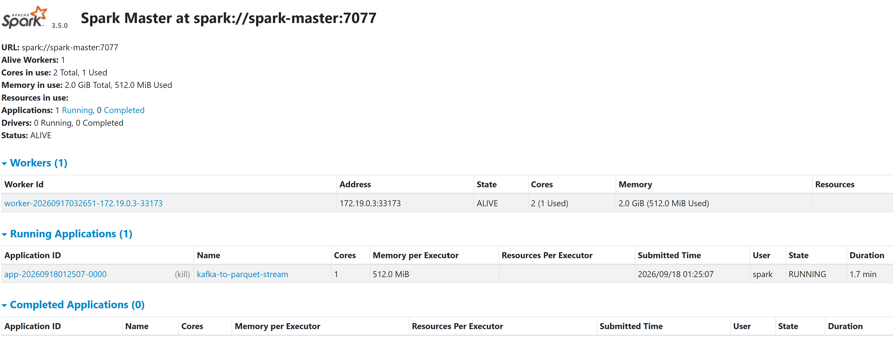

### Data-Quality Quarantine Handling

Spark validates every incoming stock-price event before it reaches the clean layer. Records that fail validation are retained in the quarantine Parquet layer with their validation reason and quarantine timestamp instead of being silently dropped.

The example below shows an intentionally invalid `AAPL` event with `price = -25.5` routed to quarantine with `validation_error = non_positive_price`.

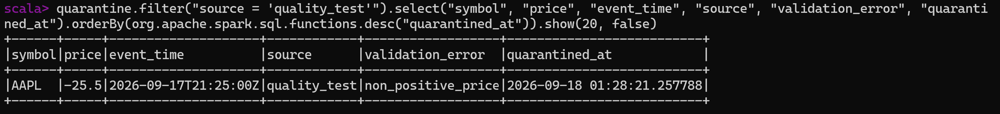

### Airflow Orchestration

Airflow schedules data-quality and pipeline-health checks every five minutes and refreshes Athena analytics every 30 minutes.

| DAG | Schedule | Responsibility |
|---|---|---|
| `pipeline_data_quality_check` | Every 5 minutes | Validates pipeline data-quality expectations |
| `pipeline_health_check` | Every 5 minutes | Verifies Kafka, Spark Master, and PostgreSQL connectivity |
| `refresh_athena_analytics` | Every 30 minutes | Creates a current-day snapshot, updates `v_latest_daily_symbol_metrics`, then builds and tests dbt views |

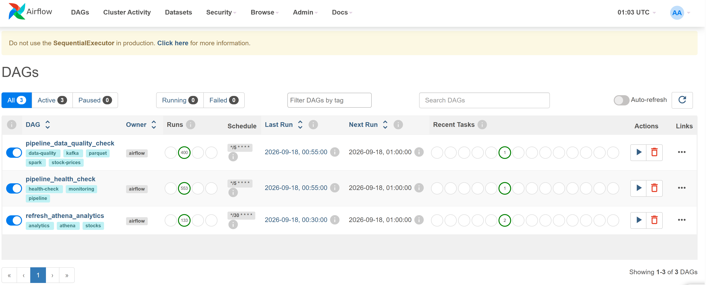

The Athena/dbt DAG permits two retries with a one-minute delay. Other DAGs use their own configured retry settings. The health-check DAG writes operational artifacts to:

```text
data/monitoring/
├── pipeline_status.json
└── pipeline_health.log
```

`pipeline_status.json` contains the latest machine-readable health snapshot, while `pipeline_health.log` maintains append-only execution history.

For operational details, see [MONITORING.md](MONITORING.md) and [RUNBOOK.md](RUNBOOK.md).

### Amazon Athena Analytics

Analytics Parquet data is synchronized to Amazon S3 and queried through the `v_latest_stock_price_summary` Athena view.

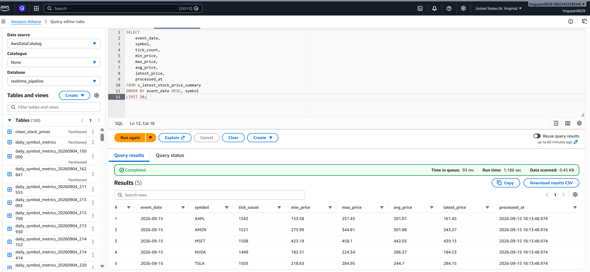

The primary cloud analytics workflow is:

```text
Clean Parquet → Analytics Parquet → Amazon S3 → Amazon Athena
```

Use the included helper to synchronize local analytics data:

```powershell
.\sync_to_s3.ps1
```

AWS credentials and bucket details remain in local configuration and are never committed.

## Pipeline Analytics Assistant

The dashboard includes a guarded natural-language assistant for pipeline health and stock-price analytics. It reads the same analytics Parquet output used by the dashboard.

The assistant uses allowlisted query patterns. It is intentionally read-only: it cannot modify data, control services, run arbitrary SQL, or provide financial advice.

Supported questions include:

```text
Summarize the latest pipeline output
What is the latest price for AAPL?
Show latest prices for AAPL, MSFT, and NVDA
Give me AAPL summary for 2026-09-15
```

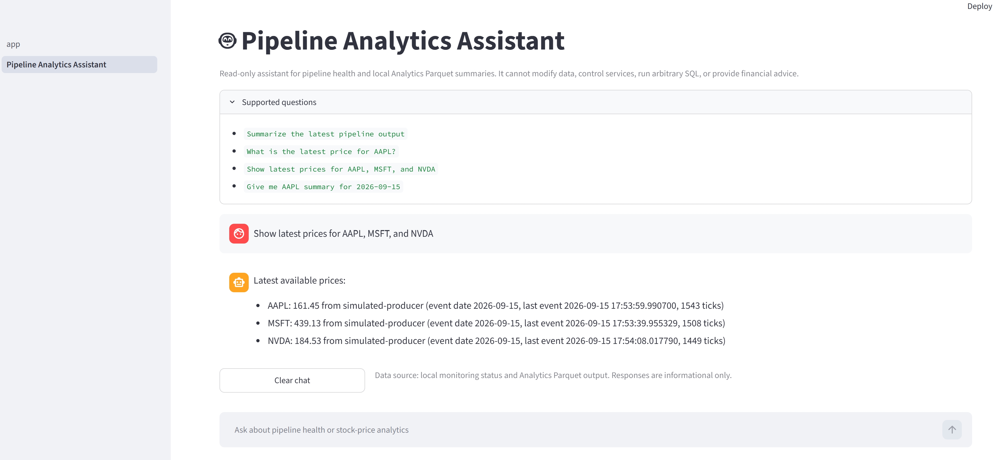

## Validation and Testing

Run Python tests from the repository root:

```powershell
python -m pytest tests -v
```

Run the Spark smoke test:

```powershell
docker exec -it spark-master /opt/spark/bin/spark-submit `
  --master spark://spark-master:7077 `
  /opt/spark-apps/smoke_test.py
```

Operational validation checklist:

- Docker services are running: `docker compose ps`
- Spark Structured Streaming is active and writing data
- Raw, clean, quarantine, metrics, and analytics layers exist under `data/`
- Invalid records include an explicit rejection reason in quarantine Parquet
- Airflow health-check and data-quality DAGs complete successfully
- `data/monitoring/pipeline_status.json` reports `healthy`
- Athena queries the S3-backed analytics table or view
- The Streamlit dashboard renders the latest analytics output
- The Pipeline Analytics Assistant answers allowlisted questions only

## Optional Google BigQuery Export

> **Optional extension:** BigQuery export and Looker Studio demonstrate a secondary warehouse/reporting path. The validated dbt cloud workflow is S3-backed Clean events → Athena → dbt views → the dedicated Streamlit dbt Analytics page. The original dashboard and assistant read local Analytics Parquet.

The `gcp/` directory contains optional utilities that export pipeline events and streaming metrics to a Google BigQuery dataset named `realtime_pipeline`.

| Script | Source | BigQuery table |
|---|---|---|
| `gcp/export_events_to_bigquery.py` | Pipeline events | `realtime_pipeline.events` |
| `gcp/export_metrics_to_bigquery.py` | Streaming metrics | `realtime_pipeline.metrics` |

### BigQuery Event Export

The optional event export loads pipeline event records into `realtime_pipeline.events` for cloud-warehouse analysis.

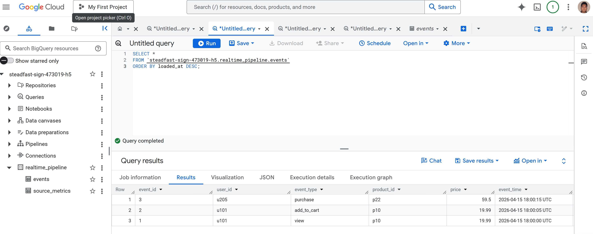

### BigQuery Metrics Export

The optional metrics export loads source-level event counts and revenue metrics into `realtime_pipeline.source_metrics`.

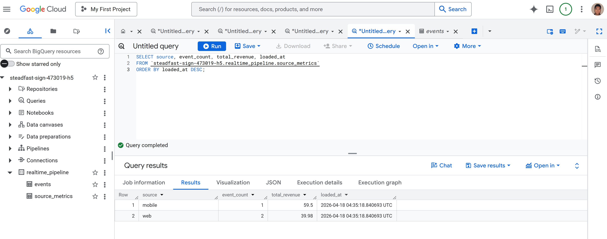

### Optional Looker Studio Exploration

A Looker Studio dashboard can visualize the optional BigQuery export path.

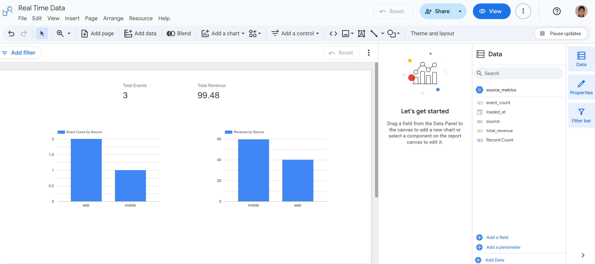

See [gcp/README.md](gcp/README.md) for requirements and usage.

## Engineering Decisions

- **Layered Parquet storage:** Raw, clean, quarantine, metrics, and analytics layers preserve traceability while separating valid events from rejected data.
- **Kafka-offset deduplication:** Kafka topic, partition, and offset provide a stable event identity within the stream.
- **Partitioned analytics:** Clean and analytics data are partitioned by event date for efficient incremental processing and cloud queries.
- **Quarantine instead of silent drops:** Invalid events are preserved with explicit error reasons.
- **Independent orchestration:** Airflow manages data quality, infrastructure health, and Athena refresh as separate workflows.
- **Retry logic:** The Athena/dbt DAG permits two retries with a one-minute delay; the dbt task has a ten-minute execution timeout.
- **Machine-readable monitoring:** The health DAG produces a current JSON status file and append-only health log.
- **Guarded AI assistant:** The assistant uses allowlisted queries and cannot modify data, execute arbitrary SQL, or operate infrastructure.
- **Local-first reproducibility:** Docker Compose runs the full local stack, while S3/Athena provides the primary cloud analytics path.
- **Optional BigQuery support:** BigQuery export utilities are isolated as a secondary integration rather than presented as a required part of the primary architecture.

## Additional Screenshots

The repository retains additional implementation and validation screenshots in the [`images/`](images/) directory, including Airflow cluster activity and Cassandra validation artifacts from supporting or exploratory work.

## Project Structure

```text
Real-Time-Data-Engineering-Pipeline/
├── airflow/
│   └── dags/
│       ├── pipeline_data_quality_check.py
│       ├── pipeline_health_check.py
│       └── refresh_athena_analytics.py
├── dashboard/
│   ├── app.py
│   └── pages/
│       └── 1_Pipeline_Analytics_Assistant.py
├── data/
│   └── monitoring/
│       └── .gitkeep
├── gcp/
│   ├── README.md
│   ├── export_events_to_bigquery.py
│   └── export_metrics_to_bigquery.py
├── images/
├── llm/
│   ├── __init__.py
│   ├── analytics_backend.py
│   ├── assistant.py
│   └── demo.py
├── producer/
│   ├── requirements.txt
│   └── stock_producer.py
├── spark/
│   └── jobs/
│       ├── build_analytics_layer.py
│       ├── kafka_stream.py
│       └── smoke_test.py
├── tests/
├── utils/
├── ARCHITECTURE.md
├── docker-compose.yml
├── MONITORING.md
├── README.md
├── RUNBOOK.md
├── run_health_check.ps1
├── start_stream.ps1
└── sync_to_s3.ps1
```

## dbt Analytics Layer

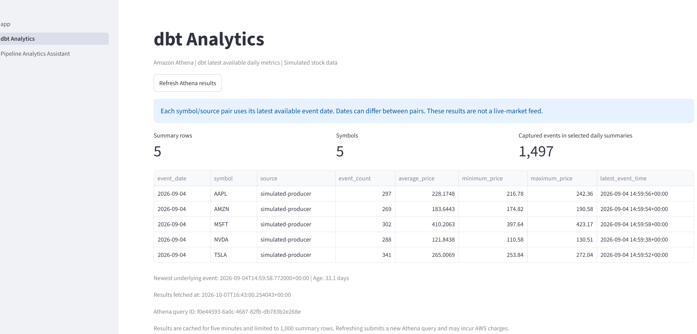

The dbt project queries the existing S3-backed Athena table
`realtime_pipeline.clean_stock_prices`. It does not ingest Kafka events,
upload local Clean files, or replace the Spark streaming job.

### Models

| Model | Materialization | Grain and purpose |
|---|---|---|
| `stg_stock_prices` | View | Event-level data with normalized symbols and retained Kafka metadata |
| `int_daily_symbol_metrics` | View | Daily captured-event metrics by event date, symbol, and source |
| `mart_latest_symbol_metrics` | View | Latest available daily metrics for each symbol/source pair |

The mart exposes event counts, average/minimum/maximum prices, event dates,
and the latest event timestamp. It does not expose a latest observed price
or claim complete market-session OHLC coverage.

Each symbol/source pair can have a different latest available date.
Historical sample data is explicitly labeled; query time is not event time.

### Automated tests

The project contains 14 data tests:

- Staging: four required-field tests and one positive-price/nonblank-symbol test.
- Intermediate: three required-field tests.
- Mart: five required-field tests and one symbol/source uniqueness test.

A successful `dbt build` reports 17 successful resources:
three models plus 14 tests. This does not represent 17 tests or an uptime SLA.

### Airflow execution

The `refresh_athena_analytics` DAG runs every 30 minutes:

```text
refresh_daily_symbol_metrics
    → update_latest_metrics_view
    → dbt_build_analytics
```

The first task creates a current-day Parquet snapshot from
`clean_stock_prices`. The second updates `v_latest_daily_symbol_metrics`.
The final task builds and tests the dbt models.

The dbt source is `clean_stock_prices`, not the snapshot view.
The dependency controls execution order; it does not make the dbt models
read the snapshot or perform an upstream S3 sync.

### Dashboard and assistant boundaries

- Original Streamlit dashboard: local Analytics Parquet and pipeline-health artifacts.
- dbt Analytics page: fixed read-only Athena query against `mart_latest_symbol_metrics`.
- LLM assistant: existing allowlisted lookups against local Analytics Parquet.

The dbt page caches results for five minutes and displays event timestamps,
result-fetch time, and an Athena query ID.

### Running dbt in Docker

The custom Airflow image uses Python 3.11 and installs dbt in
`/opt/dbt-venv`, separate from Airflow packages.

Build the image before starting the stack:

```powershell
docker compose build airflow-scheduler
docker compose up -d
```

Create the Git-ignored `dbt/profiles/profiles.yml` locally:

```yaml
stock_analytics:
  target: dev
  outputs:
    dev:
      type: athena
      database: awsdatacatalog
      schema: "{{ env_var('ATHENA_DATABASE') }}"
      region_name: "{{ env_var('AWS_REGION') }}"
      s3_staging_dir: "{{ env_var('ATHENA_OUTPUT') }}"
      threads: 2
```

Supply AWS credentials through local configuration, never committed files.
The AWS identity needs appropriate Athena, S3, and Glue permissions.

Run the models and tests:

```powershell
docker compose exec -e DBT_LOG_PATH=/tmp/dbt-logs -e DBT_TARGET_PATH=/tmp/dbt-target airflow-scheduler /opt/dbt-venv/bin/dbt build --project-dir /opt/airflow/dbt --profiles-dir /opt/airflow/dbt/profiles
```

Generate documentation:

```powershell
docker compose exec -e DBT_LOG_PATH=/tmp/dbt-docs-logs -e DBT_TARGET_PATH=/tmp/dbt-docs airflow-scheduler /opt/dbt-venv/bin/dbt docs generate --project-dir /opt/airflow/dbt --profiles-dir /opt/airflow/dbt/profiles
```

Documentation generation was validated on October 7, 2026 and produced
`index.html`, `manifest.json`, and `catalog.json`.
These files are generated under `/tmp/dbt-docs` inside the scheduler
container and are temporary; regenerate them after container replacement.
Generated metadata may contain infrastructure identifiers and should be
reviewed before publication.

### Validated sample

The October 7, 2026 validation displayed 1,497 simulated events summarized
across five symbols: AAPL, AMZN, MSFT, NVDA, and TSLA.
The displayed event date was September 4, 2026.

These are sample-validation counts, not daily throughput, live-data
freshness, or production-scale performance claims.

### New source files

```text
airflow/Dockerfile.dbt
dashboard/pages/1_dbt_Analytics.py
dbt/dbt_project.yml
dbt/models/sources.yml
dbt/models/staging/stg_stock_prices.sql
dbt/models/staging/staging.yml
dbt/models/intermediate/int_daily_symbol_metrics.sql
dbt/models/intermediate/intermediate.yml
dbt/models/marts/mart_latest_symbol_metrics.sql
dbt/models/marts/marts.yml
dbt/tests/assert_stock_price_values_valid.sql
dbt/tests/assert_latest_symbol_metrics_unique.sql
```

Local virtual environments, profiles, generated dbt artifacts, and logs
are excluded from Git.

## License

This project is licensed under the MIT License. See [LICENSE.txt](LICENSE.txt).
